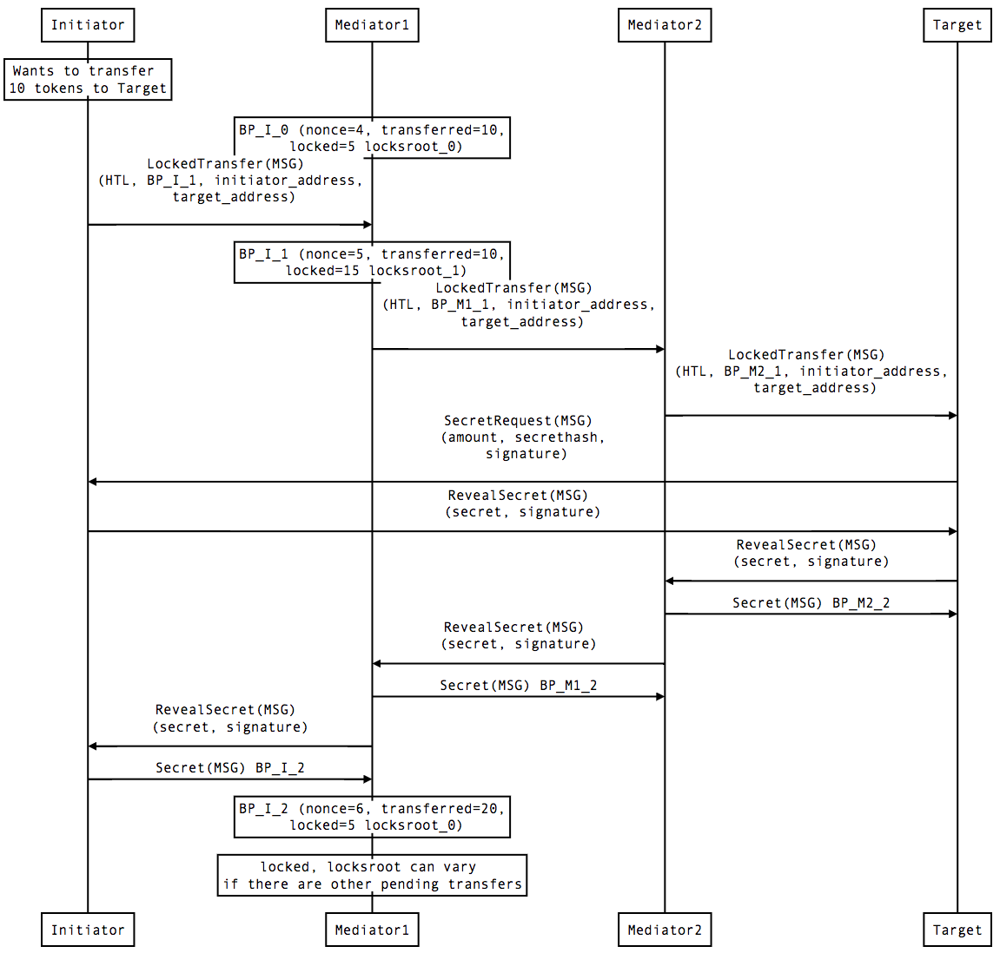
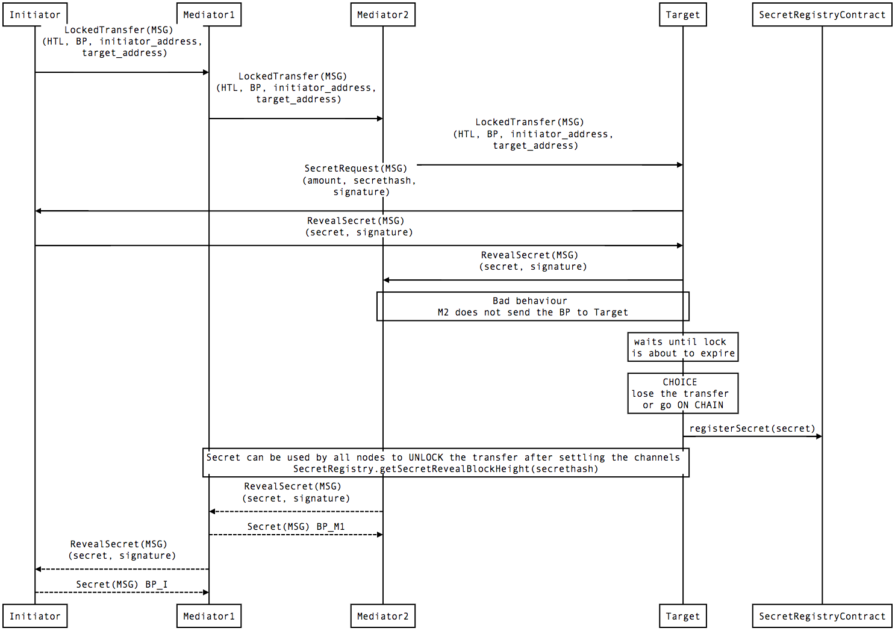

Raiden Messages Specification
#############################

Overview
========

This is the specification document for the messages used in the Raiden protocol.

Data Structures
===============

.. _balance-proof-offchain:

Offchain Balance Proof
----------------------

Data required by the smart contracts to update the payment channel end of the participant that signed the balance proof.
Messages into smart contracts contain a shorter form called :ref:`Onchain Balance Proof <balance-proof-onchain>`.

The signature must be valid and is defined as:

::

    ecdsa_recoverable(privkey, keccak256(balance_hash || nonce || additional_hash || channel_identifier || token_network_address || chain_id))

where ``additional_hash`` is the hash of the whole message being signed.

Fields
^^^^^^

+--------------------------+------------+--------------------------------------------------------------------------------+
| Field Name               | Field Type |  Description                                                                   |
+==========================+============+================================================================================+
|  nonce                   | uint256    | Strictly monotonic value used to order transfers. The nonce starts at 1        |
+--------------------------+------------+--------------------------------------------------------------------------------+
|  transferred_amount      | uint256    | Total transferred amount in the history of the channel (monotonic value)       |
+--------------------------+------------+--------------------------------------------------------------------------------+
|  locked_amount           | uint256    | Current locked amount                                                          |
+--------------------------+------------+--------------------------------------------------------------------------------+
|  locksroot               | bytes32    | Hash of the pending locks encoded and concatenated                             |
+--------------------------+------------+--------------------------------------------------------------------------------+
| token_network_identifier | address    | Address of the TokenNetwork contract                                           |
+--------------------------+------------+--------------------------------------------------------------------------------+
|  channel_identifier      | uint256    | Channel identifier inside the TokenNetwork contract                            |
+--------------------------+------------+--------------------------------------------------------------------------------+
|  additional_hash         | bytes32    | Hash of the message                                                            |
+--------------------------+------------+--------------------------------------------------------------------------------+
|  signature               | bytes      | Elliptic Curve 256k1 signature on the above data                               |
+--------------------------+------------+--------------------------------------------------------------------------------+
|  chain_id                | uint256    | Chain identifier as defined in EIP155                                          |
+--------------------------+------------+--------------------------------------------------------------------------------+

HashTimeLock
------------

Invariants
^^^^^^^^^^

- Expiration must be larger than the current block number and smaller than the channel’s settlement period.

Hash
^^^^

- ``keccak256(expiration || amount || secrethash)``

Fields
^^^^^^

+----------------------+-------------+------------------------------------------------------------+
| Field Name           | Field Type  |  Description                                               |
+======================+=============+============================================================+
|  expiration          | uint256     | Block number until which transfer can be settled           |
+----------------------+-------------+------------------------------------------------------------+
|  locked_amount       | uint256     | amount of tokens held by the lock                          |
+----------------------+-------------+------------------------------------------------------------+
|  secrethash          | bytes32     | keccak256 hash of the secret                               |
+----------------------+-------------+------------------------------------------------------------+

Messages
========

.. _locked-transfer-message:

Locked Transfer
-----------------

A Locked Transfer is a message used to reserve tokens for a mediated transfer.

Locked Transfer message
^^^^^^^^^^^^^^^^^^^^^^^^

The Locked Transfer is encoded as a JSON message and sent via our Matrix transport layer. The
message is always sent to the next mediating node, altered and (the information) forwarded until the **target** is reached.

In order to create a valid, signed JSON message, five consecutive steps are conducted.

1. Packing of the message structure of Locked Transfer to create the packed message
2. Hashing of packed message to create the :term:``additional hash``
3. Creating, packing and hashing of ``balance_data`` to get the ``balance_hash``
4. Creating the ``balance_proof`` out of ``additional_hash`` and ``balance_hash``
5. Packing the ``balance_proof`` and signing it to get the signature of the Locked Transfer

Let's assume that there is a network:

- [A] `0x540B51eDc5900B8012091cc7c83caf2cb243aa86`  
- [B] `0x2A915FDA69746F515b46C520eD511401d5CCD5e2`
- [C] `0x811957b07304d335B271feeBF46754696694b09e`

Where **A** has a channel with **B** and **B** has a channel with **C**.

A <---> B <---> C

If **A** wants to send 10 wei of a Token(0xc778417e063141139fce010982780140aa0cd5ab) to **C** he has to first
send a LockedTransfer to **B** (**recipient**) where **C** is specified as the **target**. After receiving the message,
**B** has to send a new Locked Transfer message to **C**.

The message that will be sent from A -> B over the matrix transport would look like this.

.. code-block:: json

    {
        "type": "LockedTransfer",
        "chain_id": 337,
        "message_identifier": 123456,
        "payment_identifier": 1,
        "nonce": 1,
        "token_network_address": "0xe82ae5475589b828D3644e1B56546F93cD27d1a4",
        "token": "0xc778417E063141139Fce010982780140Aa0cD5Ab",
        "channel_identifier": 1338,
        "transferred_amount": 0,
        "locked_amount": 10,
        "recipient": "0x2A915FDA69746F515b46C520eD511401d5CCD5e2",
        "locksroot": "0x7b3cb8717939d1fc4054b9ef46978ba3780556aa7b1482c65585f65a3a97f644",
        "lock": {
            "type": "Lock",
            "amount": 10,
            "expiration": 8155044,
            "secrethash": "0x59cad5948673622c1d64e2322488bf01619f7ff45789741b15a9f782ce9290a8"
        },
        "target": "0x811957b07304d335B271feeBF46754696694b09e",
        "initiator": "0x540B51eDc5900B8012091cc7c83caf2cb243aa86",
        "fee": 0,
        "signature": "0x4c9baebbaefa9a5ae6589c7764204303edc27c6186bc9ad94267fd1e9be2d3f74ddbbdb6fd0c332d6bb9943a54aa756ab3f787852a7b1ae977e5316b1b0377891c"
    }

1. Message Structure
^^^^^^^^^^^^^^^^^^^^

We define the following structure of message fields **message structure** of the Locked Transfer. There is a function
**pack(message)** that takes the **message structure** and returns a byte array. Out of this **message structure** the
necessary JSON can be created.

The message format corresponds to the packed format of LockedTransfer.

+-----------------------+----------------------+------------------------------------------------------------+
| Field Name            | Size (Type)          |  Description                                               |
+=======================+======================+============================================================+
|  command_id           | 1 Byte               | Value 7 indicates Locked Transfer                          |
+-----------------------+----------------------+------------------------------------------------------------+
|  pad                  | 3 Bytes              | Contents ignored                                           |
+-----------------------+----------------------+------------------------------------------------------------+
|  nonce                | 8 Bytes (uint64)     | See `Offchain Balance Proof`_                              |
+-----------------------+----------------------+------------------------------------------------------------+
|  chain_id             | 32 Bytes (uint256)   | See `Offchain Balance Proof`_                              |
+-----------------------+----------------------+------------------------------------------------------------+
|  message_identifier   | 8 Bytes (uint64)     | An ID for ``Delivered`` and ``Processed`` acknowledgments  |
+-----------------------+----------------------+------------------------------------------------------------+
|  payment_identifier   | 8 Bytes (uint64)     | An identifier for the payment that the initiator specifies |
+-----------------------+----------------------+------------------------------------------------------------+
|  expiration           | 32 Bytes (uint256)   | See `HashTimeLock`_                                        |
+-----------------------+----------------------+------------------------------------------------------------+
|  token_network_address| 20 Bytes (address)   | See ``token_network_id`` in `Offchain Balance Proof`_      |
+-----------------------+----------------------+------------------------------------------------------------+
|  token                | 20 Bytes (address)   | Address of the token contract                              |
+-----------------------+----------------------+------------------------------------------------------------+
|  channel_identifier   | 32 Bytes (uint256)   | See `Offchain Balance Proof`_                              |
+-----------------------+----------------------+------------------------------------------------------------+
|  recipient            | 20 Bytes (address)   | Destination for this hop of the transfer                   |
+-----------------------+----------------------+------------------------------------------------------------+
|  target               | 20 Bytes (address)   | Final destination of the payment                           |
+-----------------------+----------------------+------------------------------------------------------------+
|  initiator            | 20 Bytes (address)   | Initiator of the transfer and party who knows the secret   |
+-----------------------+----------------------+------------------------------------------------------------+
|  locksroot            | 32 Bytes (hash)      | See `Offchain Balance Proof`_                              |
+-----------------------+----------------------+------------------------------------------------------------+
|  secrethash           | 32 Bytes (hash)      | See `HashTimeLock`_                                        |
+-----------------------+----------------------+------------------------------------------------------------+
|  transferred_amount   | 32 Bytes (uint256)   | See `Offchain Balance Proof`_                              |
+-----------------------+----------------------+------------------------------------------------------------+
|  locked_amount        | 32 Bytes (uint256)   | See `Offchain Balance Proof`_                              |
+-----------------------+----------------------+------------------------------------------------------------+
|  amount               | 32 Bytes (uint256)   | Transferred amount including fees. See `HashTimeLock`_     |
+-----------------------+----------------------+------------------------------------------------------------+
|  fee                  | 32 Bytes (uint256)   | Total available fee for remaining mediators                |
+-----------------------+----------------------+------------------------------------------------------------+

2. Additional Hash
^^^^^^^^^^^^^^^^^^

We will build our **message structure** using the data in the JSON message that was presented above.

+-----------------------+-----------------------------------------------------------------------------------+
| Field                 | Data                                                                              |
+-----------------------+-----------------------------------------------------------------------------------+
| command_id            | 7                                                                                 |
+-----------------------+-----------------------------------------------------------------------------------+
| pad                   | three zero bytes                                                                  |
+-----------------------+-----------------------------------------------------------------------------------+
| nonce                 | 1                                                                                 |
+-----------------------+-----------------------------------------------------------------------------------+
| chain_id              | 337                                                                               |
+-----------------------+-----------------------------------------------------------------------------------+
| message_identifier    | 123456                                                                            |
+-----------------------+-----------------------------------------------------------------------------------+
| payment_identifier    | 1                                                                                 |
+-----------------------+-----------------------------------------------------------------------------------+
| expiration            | 8155044                                                                           |
+-----------------------+-----------------------------------------------------------------------------------+
| token_network_address | 0xe82ae5475589b828D3644e1B56546F93cD27d1a4                                        |
+-----------------------+-----------------------------------------------------------------------------------+
| token                 | 0xc778417E063141139Fce010982780140Aa0cD5Ab                                        |
+-----------------------+-----------------------------------------------------------------------------------+
| channel_identifier    | 1338                                                                              |
+-----------------------+-----------------------------------------------------------------------------------+
| recipient             | 0x811957b07304d335B271feeBF46754696694b09e                                        |
+-----------------------+-----------------------------------------------------------------------------------+
| target                | 0x811957b07304d335B271feeBF46754696694b09e                                        |
+-----------------------+-----------------------------------------------------------------------------------+
| initiator             | 0x540B51eDc5900B8012091cc7c83caf2cb243aa86                                        |
+-----------------------+-----------------------------------------------------------------------------------+
| locksroot             | 0x7b3cb8717939d1fc4054b9ef46978ba3780556aa7b1482c65585f65a3a97f644                |
+-----------------------+-----------------------------------------------------------------------------------+
| secrethash            | 0x59cad5948673622c1d64e2322488bf01619f7ff45789741b15a9f782ce9290a8                |
+-----------------------+-----------------------------------------------------------------------------------+
| transferred_amount    | 0                                                                                 |
+-----------------------+-----------------------------------------------------------------------------------+
| locked_amount         | 10                                                                                |
+-----------------------+-----------------------------------------------------------------------------------+
| amount                | 10                                                                                |
+-----------------------+-----------------------------------------------------------------------------------+
| fee                   | 0                                                                                 |
+-----------------------+-----------------------------------------------------------------------------------+

This will be used to generate the the data field called ``additional_hash``.

The ``additional_hash`` is a required part of the process to create the message signature.

To generate the ``additional_hash`` we can start by packing the **message structure**.

.. code-block:: 

    packed_message_data = pack(message_structure)

    0x0700000000000000000000010000000000000000000000000000000000000000000000000000000000000151000000000001e240000000000000000100000000000000000000000000000000000000000000000000000000007c6fa4e82ae5475589b828d3644e1b56546f93cd27d1a4c778417e063141139fce010982780140aa0cd5ab000000000000000000000000000000000000000000000000000000000000053a2a915fda69746f515b46c520ed511401d5ccd5e2811957b07304d335b271feebf46754696694b09e540b51edc5900b8012091cc7c83caf2cb243aa867b3cb8717939d1fc4054b9ef46978ba3780556aa7b1482c65585f65a3a97f64459cad5948673622c1d64e2322488bf01619f7ff45789741b15a9f782ce9290a80000000000000000000000000000000000000000000000000000000000000000000000000000000000000000000000000000000000000000000000000000000a000000000000000000000000000000000000000000000000000000000000000a0000000000000000000000000000000000000000000000000000000000000000

After creating the packed form of the data we can use ``keccak256`` to create the ``additional_hash``. 

.. code-block:: 

    additional_hash = keccak256(packed_message_data)

    0xaeba3609fa01beca6b0b54f49780f301d59a8994bc0b383b2571eee0e6dacad4

3. Balance Hash
^^^^^^^^^^^^^^^

Before we generate the message signature another hash needs to be created. This is the ``balance_hash`` that is
generated using the ``balance_data``:

You can see the structure of the ``balance_data`` below - using our example data:

+-----------------------+----------------------------------------------------------------------+
| Field                 | Data                                                                 |
+-----------------------+----------------------------------------------------------------------+
| transferred_amount    | 0                                                                    |
+-----------------------+----------------------------------------------------------------------+
| locked_amount         | 10                                                                   |
+-----------------------+----------------------------------------------------------------------+
| locksroot             | 0x7b3cb8717939d1fc4054b9ef46978ba3780556aa7b1482c65585f65a3a97f644   |
+-----------------------+----------------------------------------------------------------------+

In order to create the ``balance_hash`` you first need to pack the ``balance_data``:

.. code-block:: 

    packed_balance = pack(balance_data)

    0x0000000000000000000000000000000000000000000000000000000000000000000000000000000000000000000000000000000000000000000000000000000a7b3cb8717939d1fc4054b9ef46978ba3780556aa7b1482c65585f65a3a97f644

Add then use the ``keccak256`` hash function on the packed form.

.. code-block::

    balance_hash = keccak256(packed_balance)

    0x2bc27bf596b1f55496848b46edce26b7b7b8b8561fc6783c49b8b5d6a26fc0e1

4. Balance Proof
^^^^^^^^^^^^^^^^

The signature of a Locked Transfer is created by signing the packed form of a ``balance_proof``.

A ``balance_proof`` contains the following fields - using our example data:

+-----------------------+----------------------------------------------------------------------+
| Field                 | Data                                                                 |
+-----------------------+----------------------------------------------------------------------+
| token_network_address | 0xe82ae5475589b828d3644e1b56546f93cd27d1a4                           |
+-----------------------+----------------------------------------------------------------------+
| chain_id              | 337                                                                  |
+-----------------------+----------------------------------------------------------------------+
| msg_type              | 1                                                                    |
+-----------------------+----------------------------------------------------------------------+
| channel_identifier    | 1338                                                                 |
+-----------------------+----------------------------------------------------------------------+
| balance_hash          | 0x2bc27bf596b1f55496848b46edce26b7b7b8b8561fc6783c49b8b5d6a26fc0e1   |
+-----------------------+----------------------------------------------------------------------+
| nonce                 | 1                                                                    |
+-----------------------+----------------------------------------------------------------------+
| additional_hash       | 0xaeba3609fa01beca6b0b54f49780f301d59a8994bc0b383b2571eee0e6dacad4   |
+-----------------------+----------------------------------------------------------------------+

The ``additional_hash`` and the ``balance_hash`` were calculated in the previous steps and we can now use them in the
``balance_proof``.

In order to create the ``singature`` of the Locked Transfer we first need to pack the ``balance_proof``:

.. code-block:: 

    packed_balance_proof = pack(balance_proof)

    0xe82ae5475589b828d3644e1b56546f93cd27d1a400000000000000000000000000000000000000000000000000000000000001510000000000000000000000000000000000000000000000000000000000000001000000000000000000000000000000000000000000000000000000000000053a2bc27bf596b1f55496848b46edce26b7b7b8b8561fc6783c49b8b5d6a26fc0e10000000000000000000000000000000000000000000000000000000000000001aeba3609fa01beca6b0b54f49780f301d59a8994bc0b383b2571eee0e6dacad4

5. Signature
^^^^^^^^^^^^

After getting the packed form of the ``balance_proof`` we have to sign it in order to generate the message signature.

.. code-block:: 

    signature = eth_sign(privkey=private_key, data=packed_balance_proof)

    0x4c9baebbaefa9a5ae6589c7764204303edc27c6186bc9ad94267fd1e9be2d3f74ddbbdb6fd0c332d6bb9943a54aa756ab3f787852a7b1ae977e5316b1b0377891c

Preconditions for LockedTransfer
^^^^^^^^^^^^^^^^^^^^^^^^^^^^^^^^

For a Locked Transfer to be considered valid there are the following conditions. The message will be rejected otherwise:

- (PC1) :term:`nonce` is increased by ``1`` with respect to the previous balance changing message in that direction
- (PC2) :term:`chain id`, :term:`token network` address, and :term:`channel identifier` refers to an existing and open channel
- (PC3) :term:`expiration` must be greater than the current block number
- (PC4) :term:`locksroot` must be equal to the hash of a new list of all currently pending locks, always the latest one appended at last position
- (PC5) :term:`transferred amount` must not change compared to the last :term:`balance proof`
- (PC6) :term:`locked amount` must increase by exactly :term:`amount` [#PC6]_
- (PC7) :term:`amount` must be smaller than the current :term:`capacity` [#PC7]_

.. [#PC6] If the :term:`locked amount` is increased by more, then funds may get locked in the channel. If the :term:`locked amount` is increased by less, then the recipient will reject the message as it may mean it received the funds with an on-chain unlock. The initiator will stipulate the fees based on the available routes and incorporate it in the lock's amount. Note that with permissive routing it is not possible to predetermine the exact `fee` amount, as the initiator does not know which nodes are available, thus an estimated value is used.
.. [#PC7] If the amount is higher then the recipient will reject it, as it means he will be spending money it does not own.

Example Data
""""""""""""

All the examples are made using three predifined accounts, so that you can replicate the results and verify:

+----+--------------------------------------------+------------------------------------------------------------------+
| No | Address                                    | Private Key                                                      |
+----+--------------------------------------------+------------------------------------------------------------------+
| 1  | 0x540B51eDc5900B8012091cc7c83caf2cb243aa86 | 377261472824796f2c4f6a73753136587b5624777a4537503b39324a227e227d |
+----+--------------------------------------------+------------------------------------------------------------------+
| 2  | 0x811957b07304d335B271feeBF46754696694b09e | 7c250a70410d7245412f6d576b614d275f0b277953433250777323204940540c |
+----+--------------------------------------------+------------------------------------------------------------------+
| 3  | 0x2A915FDA69746F515b46C520eD511401d5CCD5e2 | 2e20593e0b5923294a6d6f3223604433382b782b736e3d63233c2d3a2d357041 |
+----+--------------------------------------------+------------------------------------------------------------------+

The sender of the message should be computable from ``signature`` so is not included in the message.

.. _lock-expired-message:

Lock Expired
--------------

Message used to inform partner that the :term:`lock` has expired. Sent by the :term:`initiator` to the :term:`mediator` or :term:`target` when the following conditions are met:

Preconditions
^^^^^^^^^^
- once the current confirmed block reached the lock's expiry block number.
  confirmed block is calculated to be `current_block_number + NUMBER_OF_CONFIRMATION_BLOCKS`.
- For the lock expired message to be sent, the :term:`initiator` waits until the `expiration + NUMBER_OF_CONFIRMATIONS * 2` is reached.
- For the :term:`mediator` or :term:`target`, the lock expired is accepted once the current `expiration + NUMBER_OF_CONFIRMATION`
- The :term:`initiator` or :term:`mediator` must wait until the lock removal block is reached.
- The :term:`initiator`, :term:`mediator` or :term:`target` must not have registered the secret on-chain before expiring the lock.
- The :term:`mediator` or :term:`target`
- The :term:`nonce` is increased by ``1`` in respect to the previous :term:`balance proof`
- The :term:`locksroot` must change, the new value must be equal to the root of a new tree after the expired lock is removed.
- The :term:`locked amount` must decrease, the new value should be to the old value minus the lock's amount.
- The :term:`transferred amount` must not change.

Message Fields
^^^^^^^^^^^^^^

+-----------------------+----------------------+------------------------------------------------------------+
| Field Name            | Field Type           |  Description                                               |
+=======================+======================+============================================================+
|  command_id           | one byte             | Value 7 indicating ``LockedTransfer``                      |
+-----------------------+----------------------+------------------------------------------------------------+
|  pad                  | three bytes          | Contents ignored                                           |
+-----------------------+----------------------+------------------------------------------------------------+
|  nonce                | uint64               | See `Offchain Balance Proof`_                              |
+-----------------------+----------------------+------------------------------------------------------------+
|  chain_id             | uint256              | See `Offchain Balance Proof`_                              |
+-----------------------+----------------------+------------------------------------------------------------+
|  message_identifier   | uint64               | An ID for ``Delivered`` and ``Processed`` acknowledgments  |
+-----------------------+----------------------+------------------------------------------------------------+
|  token_network_address| address              | See ``token_network_id`` in `Offchain Balance Proof`_      |
+-----------------------+----------------------+------------------------------------------------------------+
|  channel_identifier   | uint256              | See `Offchain Balance Proof`_                              |
+-----------------------+----------------------+------------------------------------------------------------+
|  recipient            | address              | Destination for this hop of the transfer                   |
+-----------------------+----------------------+------------------------------------------------------------+
|  locksroot            | bytes32              | See `Offchain Balance Proof`_                              |
+-----------------------+----------------------+------------------------------------------------------------+
|  secrethash           | bytes32              | See `HashTimeLock`_                                        |
+-----------------------+----------------------+------------------------------------------------------------+
|  transferred_amount   | uint256              | See `Offchain Balance Proof`_                              |
+-----------------------+----------------------+------------------------------------------------------------+
|  locked_amount        | uint256              | See `Offchain Balance Proof`_                              |
+-----------------------+----------------------+------------------------------------------------------------+
|  signature            | 65 bytes             | Computed as in `Offchain Balance Proof`_                   |
+-----------------------+----------------------+------------------------------------------------------------+

.. _secret-request-message:

Secret Request
--------------

Message used to request the :term:`secret` that unlocks a lock. Sent by the payment :term:`target` to the :term:`initiator` once a :ref:`locked transfer <locked-transfer-message>` is received.

Invariants
^^^^^^^^^^

- The :term:`initiator` must have initiated a payment to the :term:`target` with the same ``payment_identifier``, ``lock_secrethash``, ``payment_amount`` and ``expiration``.
- The :term:`target` must have received a :term:`Locked Transfer` for the payment.
- The ``signature`` must be from the :term:`target`.

Fields
^^^^^^

This should match `the encoding implementation <https://github.com/raiden-network/raiden/blob/16384b555b63c69aef8c2a575afc7a67610eb2bc/raiden/encoding/messages.py#L99>`_.

+----------------------+---------------+------------------------------------------------------------+
| Field Name           | Field Type    |  Description                                               |
+======================+===============+============================================================+
|  cmdid               | one byte      | Value 3 (indicating ``Secret Request``)                    |
+----------------------+---------------+------------------------------------------------------------+
|  pad                 | three bytes   | Ignored                                                    |
+----------------------+---------------+------------------------------------------------------------+
|  message identifier  | uint64        | An ID used in ``Delivered`` and ``Processed``              |
|                      |               | acknowledgments                                            |
+----------------------+---------------+------------------------------------------------------------+
|  payment_identifier  | uint64        | An identifier for the payment chosen by the initiator      |
+----------------------+---------------+------------------------------------------------------------+
|  lock_secrethash     | bytes32       | Specifies which lock is being unlocked                     |
+----------------------+---------------+------------------------------------------------------------+
|  payment_amount      | uint256       | The amount received by the node once secret is revealed    |
+----------------------+---------------+------------------------------------------------------------+
|  expiration          | uint256       | See `HashTimeLock`_                                        |
+----------------------+---------------+------------------------------------------------------------+
|  signature           | bytes         | Elliptic Curve 256k1 signature                             |
+----------------------+---------------+------------------------------------------------------------+

.. _reveal-secret-message:

Reveal Secret
-------------

Message used by the nodes to inform others that the :term:`secret` is known. Used to request an updated :term:`balance proof` with the :term:`transferred amount` increased and the lock removed.

Fields
^^^^^^

This should match `the encoding implementation <https://github.com/raiden-network/raiden/blob/8ead49a8ee688691c98828a879d93f822f60ae53/raiden/encoding/messages.py#L132>`__.

+----------------------+---------------+------------------------------------------------------------+
| Field Name           | Field Type    |  Description                                               |
+======================+===============+============================================================+
|  cmdid               | one byte      | Value 11 (indicating ``Reveal Secret``)                    |
+----------------------+---------------+------------------------------------------------------------+
|  pad                 | three bytes   | Ignored                                                    |
+----------------------+---------------+------------------------------------------------------------+
|  message identifier  | uint64        | An ID use in ``Delivered`` and ``Processed``               |
|                      |               | acknowledgments                                            |
+----------------------+---------------+------------------------------------------------------------+
|  lock_secret         | bytes32       | The secret that unlocks the lock                           |
+----------------------+---------------+------------------------------------------------------------+
|  signature           | bytes         | Elliptic Curve 256k1 signature                             |
+----------------------+---------------+------------------------------------------------------------+

.. _unlock-message:

Unlock
------

.. Note:: At the current (15/02/2018) Raiden implementation as of commit ``cccfa572298aac8b14897ee9677e88b2b55c9a29`` this message is known in the codebase as ``Secret``.

Non cancellable, Non expirable.

Invariants
^^^^^^^^^^

- The :term:`balance proof` must contain the hash of the new list of pending locks, from which the unlocked lock has been removed.
- This message is only sent after the corresponding partner has sent a :ref:`Reveal Secret message <reveal-secret-message>`.
- The :term:`nonce` is increased by ``1`` with respect to the previous :term:`balance proof`
- The :term:`locked amount` must decrease and the :term:`transferred amount` must increase by the amount held in the unlocked lock.

Fields
^^^^^^

This should match `the Secret message in encoding/messages file <https://github.com/raiden-network/raiden/blob/a19a6c853b55f13725f2545c77b0475cbcc86807/raiden/encoding/messages.py#L113>`_.

+----------------------+------------------------+------------------------------------------------------------+
| Field Name           | Field Type             |  Description                                               |
+======================+========================+============================================================+
|  command id          | one byte               | Value 4 indicating Unlock                                  |
+----------------------+------------------------+------------------------------------------------------------+
|  padding             | three bytes            | Ignored                                                    |
+----------------------+------------------------+------------------------------------------------------------+
|  chain identifier    | uint256                | See :ref:`balance-proof-offchain`                          |
+----------------------+------------------------+------------------------------------------------------------+
|  message identifier  | uint64                 | An ID used in ``Delivered`` and ``Processed``              |
|                      |                        | acknowledgments                                            |
+----------------------+------------------------+------------------------------------------------------------+
|  payment identifier  | uint64                 | An identifier for the :term:`Payment` chosen by the        |
|                      |                        | :term:`Initiator`                                          |
+----------------------+------------------------+------------------------------------------------------------+
| token network        | address                | See :ref:`balance-proof-offchain`                          |
| identifier           |                        |                                                            |
+----------------------+------------------------+------------------------------------------------------------+
|  lock_secret         | bytes32                | The secret that unlocked the lock                          |
+----------------------+------------------------+------------------------------------------------------------+
|  nonce               | uint64                 | See :ref:`balance-proof-offchain`                          |
+----------------------+------------------------+------------------------------------------------------------+
|  channel identifier  | uint256                | See :ref:`balance-proof-offchain`                          |
+----------------------+------------------------+------------------------------------------------------------+
|  transferred amount  | uint256                | See :ref:`balance-proof-offchain`                          |
+----------------------+------------------------+------------------------------------------------------------+
|  locked amount       | uint256                | See :ref:`balance-proof-offchain`                          |
+----------------------+------------------------+------------------------------------------------------------+
|  lockedsroot         | bytes32                | See :ref:`balance-proof-offchain`                          |
+----------------------+------------------------+------------------------------------------------------------+
|  signature           | bytes                  | See :ref:`balance-proof-offchain`. Note ``additional_hash``|
|                      |                        | is the hash of the whole message                           |
+----------------------+------------------------+------------------------------------------------------------+

.. _withdraw-request-message:

Withdraw Request
-------------

Message used by the a channel participant node to request the other participant signature on a new increased ``total_withdraw`` value.

Preconditions
^^^^^^^^^^^^^

- The channel for which the withdraw is requested must be open.
- The ``total_withdraw`` value must only ever increase.
- The participant's channel unlocked balance must be larger or equal to ``withdraw_amount``,
  which is calculated using ``new_total_withdraw - previous_total_withdraw``.
- The new total_withdraw value must not cause an underflow or overflow.
- The message must be sent by one of the channel participants.
- The :term:`nonce` is increased by ``1`` with respect to the previous :term:`nonce`.
- The message sender address must be the same as ``participant``.
- The ``signature`` must be from the :term:`sender` of the request.

Fields
^^^^^^

+-------------------------------+---------------+----------------------------------------------------------------+
| Field Name                    | Field Type    |  Description                                                   |
+===============================+===============+================================================================+
|  cmdid                        | one byte      | Value 15 (indicating ``Withdraw Request``)                     |
+-------------------------------+---------------+----------------------------------------------------------------+
|  chain identifier             | uint256       | See :ref:`balance-proof-offchain                               |
+-------------------------------+---------------+----------------------------------------------------------------+
|  channel identifier           | uint256       | See :ref:`balance-proof-offchain`                              |
+-------------------------------+---------------+----------------------------------------------------------------+
|  token network address        | address       | See :ref:`balance-proof-offchain`                              |
+-------------------------------+---------------+----------------------------------------------------------------+
|  message identifier           | uint64        | An ID used in ``Delivered`` and ``Processed`` acknowledgements |
+-------------------------------+---------------+----------------------------------------------------------------+
|  participant                  | address       | The address of the withdraw requesting node                    |
+-------------------------------+---------------+----------------------------------------------------------------+
|  total_withdraw               | uint256       | The new monotonic ``total_withdraw`` value                     |
+-------------------------------+---------------+----------------------------------------------------------------+
|  expiration                   | uint256       | The block number at which withdraw request is no longer        |
|                               |               | usable on-chain.                                               |
+-------------------------------+---------------+----------------------------------------------------------------+
|  nonce                        | uint64        | See :ref:`balance-proof-offchain`                              |
+-------------------------------+---------------+----------------------------------------------------------------+
|  signature                    | bytes         | Elliptic Curve 256k1 signature                                 |
|                               |               | Signed data:                                                   |
|                               |               | - Chain identifier                                             |
|                               |               | - Message type, 3 for withdraw                                 |
|                               |               | - Channel identifier                                           |
|                               |               | - Participant (address of the withdraw requesting node)        |
|                               |               | - Total withdraw                                               |
|                               |               | - Expiration block number                                      |
+-------------------------------+---------------+----------------------------------------------------------------+

.. _withdraw-confirmation-message:

Withdraw Confirmation
-------------

Message used by the :ref:`withdraw-request-message` receiver to confirm the request after validating it's input.

Preconditions
^^^^^^^^^^^^^

- The channel for which the withdraw is confirmed should be open.
- The received confirmation should map to a previously sent request.
- The block at which withdraw expires should not have been reached.
- The participant's channel balance should still be larger or equal to ``withdraw_amount``.
- The new total_withdraw value should not cause an underflow or overflow.
- The message should be sent by one of the channel participants.
- The :term:`nonce` is increased by ``1`` with respect to the previous :term:`nonce`
- The ``signature`` must be from the :term:`sender` of the request.

Fields
^^^^^^

+-------------------------------+---------------+----------------------------------------------------------------+
| Field Name                    | Field Type    |  Description                                                   |
+===============================+===============+================================================================+
|  cmdid                        | one byte      | Value 16 (indicating ``Withdraw Confirmation``)                |
+-------------------------------+---------------+----------------------------------------------------------------+
|  chain identifier             | uint256       | See :ref:`balance-proof-offchain                               |
+-------------------------------+---------------+----------------------------------------------------------------+
|  channel identifier           | uint256       | See :ref:`balance-proof-offchain`                              |
+-------------------------------+---------------+----------------------------------------------------------------+
|  token network address        | address       | See :ref:`balance-proof-offchain`                              |
+-------------------------------+---------------+----------------------------------------------------------------+
|  message identifier           | uint64        | An ID used in ``Delivered`` and ``Processed`` acknowledgements |
+-------------------------------+---------------+----------------------------------------------------------------+
|  participant                  | address       | The address of the withdraw requesting node                    |
+-------------------------------+---------------+----------------------------------------------------------------+
|  total_withdraw               | uint256       | The new monotonic ``total_withdraw`` value                     |
+-------------------------------+---------------+----------------------------------------------------------------+
|  expiration                   | uint256       | The block number at which withdraw request is no longer        |
|                               |               | usable on-chain.                                               |
+-------------------------------+---------------+----------------------------------------------------------------+
|  nonce                        | uint64        | See :ref:`balance-proof-offchain`                              |
+-------------------------------+---------------+----------------------------------------------------------------+
|  signature                    | bytes         | Elliptic Curve 256k1 signature                                 |
|                               |               | Signed data: see :ref:`withdraw-request-message`               |
+-------------------------------+---------------+----------------------------------------------------------------+

.. _withdraw-expired-message:

Withdraw Expired
-------------

Message used by the withdraw-requesting node to inform the partner that the earliest-requested, non-confirmed withdraw has expired.

Preconditions
^^^^^^^^^^^^^

- The channel for which the withdraw is confirmed should be open.
- The sender waits ``expiration_block + NUMBER_OF_CONFIRMATION * 2`` until the message is sent.
- The receiver should only accept the expiration message if the block at which the withdraw expires is confirmed.
- The received withdraw expiration should map to an existing withdraw state.
- The message should be sent by one of the channel participants.
- The :term:`nonce` is increased by ``1`` with respect to the previous :term:`nonce`
- The ``signature`` must be from the :term:`sender` of the request.

Fields
^^^^^^

+-------------------------------+---------------+----------------------------------------------------------------+
| Field Name                    | Field Type    |  Description                                                   |
+===============================+===============+================================================================+
|  cmdid                        | one byte      | Value 17 (indicating ``Withdraw Expired``)                     |
+-------------------------------+---------------+----------------------------------------------------------------+
|  chain identifier             | uint256       | See :ref:`balance-proof-offchain                               |
+-------------------------------+---------------+----------------------------------------------------------------+
|  channel identifier           | uint256       | See :ref:`balance-proof-offchain`                              |
+-------------------------------+---------------+----------------------------------------------------------------+
|  token network address        | address       | See :ref:`balance-proof-offchain`                              |
+-------------------------------+---------------+----------------------------------------------------------------+
|  message identifier           | uint64        | An ID used in ``Delivered`` and ``Processed`` acknowledgements |
+-------------------------------+---------------+----------------------------------------------------------------+
|  participant                  | address       | The address of the withdraw requesting node                    |
+-------------------------------+---------------+----------------------------------------------------------------+
|  total_withdraw               | uint256       | The new monotonic ``total_withdraw`` value                     |
+-------------------------------+---------------+----------------------------------------------------------------+
|  expiration                   | uint256       | The block number at which withdraw request is no longer        |
|                               |               | usable on-chain.                                               |
+-------------------------------+---------------+----------------------------------------------------------------+
|  nonce                        | uint64        | See :ref:`balance-proof-offchain`                              |
+-------------------------------+---------------+----------------------------------------------------------------+
|  signature                    | bytes         | Elliptic Curve 256k1 signature                                 |
|                               |               | Signed data: see :ref:`withdraw-request-message`               |
+-------------------------------+---------------+----------------------------------------------------------------+

Specification
=============

The encoding used by the transport layer is independent of this specification, as long as the signatures using the data are encoded in the EVM big endian format.

Transfers
---------

The protocol supports mediated transfers. A :term:`Mediated transfer` may be cancelled and can expire unless the initiator reveals the secret.

A mediated transfer is done in two stages, possibly on a series of channels:

- Reserve token :term:`capacity` for a given payment, using a :ref:`locked transfer message <locked-transfer-message>`.
- Use the reserved token amount to complete payments, using the :ref:`unlock message <unlock-message>`

Message Flow
------------

Nodes may use mediated transfers to send payments.

Mediated Transfer
^^^^^^^^^^^^^^^^^

A :term:`Mediated Transfer` is a hash-time-locked transfer. Currently raiden supports only one type of lock. The lock has an amount that is being transferred, a :term:`secrethash` used to verify the secret that unlocks it, and a :term:`lock expiration` to determine its validity.

Mediated transfers have an :term:`initiator` and a :term:`target` and a number of mediators in between. The number of mediators can also be zero as these transfers can also be sent to a direct partner. Assuming ``N`` number of mediators, a mediated transfer will require ``10N + 16`` messages to complete. These are:

- ``N + 1`` :term:`locked transfer` or :term:`refund transfer` messages
- ``1`` :term:`secret request`
- ``N + 2`` :term:`reveal secret`
- ``N + 1`` :term:`unlock`
- ``2N + 3`` processed (one for everything above)
- ``5N + 8`` delivered

For the simplest Alice - Bob example:

- Alice wants to transfer ``n`` tokens to Bob.
- Alice creates a new transfer with:
    * transferred_amount = ``current_value``
    * lock = ``Lock(n, hash(secret), expiration)``
    * locked_amount = ``updated value containing the lock amount``
    * locksroot = ``updated value containing the lock``
    * nonce = ``current_value + 1``
- Alice signs the transfer and sends it to Bob.
- Bob requests the secret that can be used for withdrawing the transfer by sending a ``SecretRequest`` message.
- Alice sends the ``RevealSecret`` to Bob and at this point she must assume the transfer is complete.
- Bob receives the secret and at this point has effectively secured the transfer of ``n`` tokens to his side.
- Bob sends a ``RevealSecret`` message back to Alice to inform her that the secret is known and acts as a request for off-chain synchronization.
- Finally Alice sends an ``Unlock`` message to Bob. This acts also as a synchronization message informing Bob that the lock will be removed from the list of pending locks and that the transferred_amount and locksroot values are updated.

**Mediated Transfer - Best Case Scenario**

In the best case scenario, all Raiden nodes are online and send the final balance proofs off-chain.

**Mediated Transfer - Worst Case Scenario**

In case a Raiden node goes offline or does not send the final balance proof to its payee, then the payee can register the ``secret`` on-chain, in the ``SecretRegistry`` smart contract before the ``secret`` expires. This can be used to ``unlock`` the lock on-chain after the channel is settled.

**Limit to number of simultaneously pending transfers**

The number of simultaneously pending transfers per channel is limited. The client will not initiate, mediate or accept a further pending transfer if the limit is reached. This is to avoid the risk of not being able to unlock the transfers, as the gas cost for this operation grows with the number of the pending locks and thus the number of pending transfers.

The limit is currently set to 160. It is a rounded value that ensures the gas cost of unlocking will be less than 40% of Ethereum's traditional pi-million (3141592) block gas limit.
