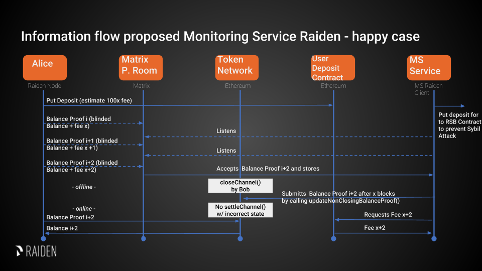

.. _ms:

Raiden Monitoring Service
#########################

Summary
=======
*   Monitoring Service (MS) listens to Monitor Requests (MRs - blinded Balance Proofs) and offered rewards in a public Matrix Room
*   Any pre-registered MS can decide to monitor a channel and store corresponding MRs
*   Then, whenever a channel is closed by calling ``closeChannel`` and after a period of x blocks where the client is
    expected the react, the MS will call ``updateNonClosingBalanceProof`` with the submitted MR by its client
*   Rewards are paid in RDN, there is no free tier
*   In the short term we go for a simple design which will allow us to reach the Ithaca milestone earlier
*   In the long-term we see the PISA approach as more economically viable and user friendly, but this design requires
    additional features and can be developed independently after Ithaca

Usual Scenario
==============

The Raiden node that belongs to Alice is going offline and Alice wants to be protected against having her channels
closed by Bob with an incorrect balance proof.

1)  Whenever Alice wants to get her channel monitored, Alice publishes her `Monitor Request`_ - including a blinded balance
    proofs - into a public chat room
2)  Updates can be sent by Alice whenever the state or offered reward changes
3)  MSs can pick up these messages and then listen to ``ChannelClosed`` events regarding this particular channel
4)  If so, whenever the channel is closed and before the settlement period has ended, the MS will call the
    ``updateNonClosingBalanceProof`` function with the provided information, after a period of x blocks where the client
    is expected to react. This way the settleChannel function that calculates the token distribution can only be
    executed submitting the corresponding balance values of the hashed balances provided before
5)  Either Alice or Bob (or anyone else) can now anytime call ``settleChannel`` and initiate the token distribution
6)  After a successful submission of the hashed balance by the MS calling ``updateNonClosingBalanceProof`` (might be a
    defeat of an attack), the monitoring service gets an on-chain payment from a smart contract where Alice deposited
    some tokens beforehand
7)  This will result in a correct distribution of tokens, in accordance with the off-chain transfers

Information Flow
================

General Requirements for the Design of the Monitoring Service
=============================================================

*   Sybil Attack resistance (i.e. no one should be able to announce an unlimited number of possibly faulty services)
*   Some degree of redundancy (ability to register a balance proof with multiple competing monitoring services)

Design of the Monitoring Service (still work in progress)
=========================================================

Monitoring Service Registration
-------------------------------

The Monitoring Service has to be registered in the :ref:`ServiceRegistry` contract. Registry slots will be auctioned. If chosen in the auction, the service provider will become part of the list of MSs and must deposit some RDN.

Client Onboarding
-----------------

Clients that want to request this service have to deposit an amount of RDN into the UDC in order to provide rewards to
the MS. This happens during the general Raiden onboarding process, so that no additional preparation is necessary when
usage of a MS is desired.

Service Discovery
-----------------

All MS listen to a public Matrix room. Monitor Requests are broadcast and no specific MSs are appointed. The MSs can
also publish their expected rewards in this room, which does not provide any guarantees, but increases the chance of
reliable monitoring if both parties cooperate.

Monitoring Service Payment
--------------------------

The MS is paid after successfully submitting its client’s balance proof update. The payment is paid out from a deposit
in the User Deposit Contract (UDC). Ideally, only one MS submits the latest BP to the SC to avoid unnecessary gas usage.
This can be made more likely by choosing the rewarded MS based on a function of the MS’s address and the current block
number. MSs which have a low f(address, block_num) would be incentivized to wait for a block number which yields a
higher f for them, since they would probably lose out to another MS if they submitted the BP during the current block.
Incentivizing MSs to wait in some cases greatly reduces the number of MSs submitting BPs simultaneously.

Ensuring MS Reliability
-----------------------

The MS has an incentive to intervene in case of a dispute, since it is only paid in that case. There are no incentives
for a high level of reliability and the client knows neither how many MSs are monitoring his channel nor how reliable
they are. These tradeoffs are made to favor simplicity of implementation.

Privacy
-------

The recipient and the actual transferred amounts are hidden by providing a hashed balance proof (or state). This
provides some sort of privacy even if it can potentially be recalculated.

Security Analysis (inspired by PISA)
====================================

State Privacy
-------------

Blinded BPs are published to the MS as part of the Monitor Request in the matrix room and then submitted to the smart
contract.

Fair Exchange
-------------

Clients can freely choose the reward for the MS, so it is easy for him to choose the amount in a way that makes the
exchange attractive for himself. The client can’t know if a MS started monitoring his payment channel, so he can’t use
such feedback to arrive at a reward where he knows that the deal is attractive for both him and the MS. Neither can he
recognize if there is no such possible reward.
The MS on the other hand can freely choose to ignore requests when the reward is too low, so he will only choose
requests that he deems fairly rewarded. If the MS ignores the client’s request, the client keeps his deposit and it can
be used by other MSs or for later BPs. In summary, the exchange is fair for both parties, but there is a high likelihood
that no exchange will happen at all.

Non-frameability
----------------

MSs can put the clients channel deposit at risk by ignoring all client requests. But since a MS can’t force other MSs to
ignore client requests, this can not be considered as framing. When only a single MS is monitoring the channel, the MS’s
dispute intervention and the reward payment happen atomically inside the SC. In this case, no party can frame the other.

When multiple MSs try to settle the same dispute, only the first one doing so receives a reward, but all of them have to
invest resources to monitor the channel and spend gas to interact with the SC. If you find a way to continuously front
run other MSs, you can drain their resources and block their only income. However, while doing so you fulfilled the MS’s
duty to settle the payment channel correctly and protect the client’s deposit.
In the short run, this is an acceptable outcome for the client. In the long run, this will drive other MSs out of
business and thus reduce redundancy and reliability of the overall MS ecosystem. Since all MSs try to be the first to
submit a BP, it is unlikely that a single MS will continuously be the fastest, but slightly slower MSs will still not
get any rewards even if they are well behaved and reliable.

If a client wants to waste the resources of MSs, he can first broadcast a BP with a high reward and keep more recent BPs
to himself. When a dispute happens, he can wait for the MSs to act before submitting his latest BPs, which prevents the
MSs from receiving a reward. Doing this at a large scale is expensive, since the client needs to open and close a
payment channel for this at his own cost.

Recourse as a Financial Deterrent
---------------------------------

There is no possibility of recourse which lets MSs operate without any incentive of high reliability. A client must
expect MSs to ignore their requests and have no means to force a highly reliable monitoring.

Efficiency Requirements
-----------------------

For each channel, only the latest (as indicated by the nonce) BP has to be saved. Unless an extremely high amount of
channels is being monitored, this efficiency should not be a concern for the MS.
A client can use a single deposit to request an MS to monitor all his payment channels. If this causes the MS to monitor
a problematically high amount of channels, he can start to ignore requests made by this client, or even drop old
requests. Since there is no punishment for failing to monitor a channel, stopping to monitor is a simple way to reduce
resource usage when desired, although it should not be necessary under normal circumstances.

Proposed SC Logic
'''''''''''''''''

1)  Client (Raiden node) will transfer tokens used as a reward to the User Deposit Contract (UDC)
2)  Whoever calls SC’s ``updateTransfer`` method MUST supply payout address as a parameter. This address is stored in the
    UDC. ``updateTransfer`` MAY be called multiple times, but it will only accept a balance proof newer than the
    previous one
3)  When calling ``claimReward``, the reward tokens will be sent to the payout address

Appendix A: Interfaces
======================

Broadcast Interface
-------------------
Client's request to store a balance proof will be in the usual scenario broadcasted using Matrix as a transport layer.
A public chatroom will be available for anyone to join - clients will post balance proofs to the chatroom and
Monitoring Services picks them up.

Web3 Interface
--------------
Monitoring Service are required to have a synced Ethereum node with an enabled JSON-RPC interface. All blockchain
operations are performed using this connection.

Event Filtering
'''''''''''''''
MS must filter events for each on-chain channel that corresponds to the submitted balance proofs.
On ``ChannelClosed`` and ``NonClosingBalanceProofUpdated`` events state the channel was closed with the Monitoring
Service must call ``updateNonClosingBalanceProof`` with the respective latest balance proof provided by its client.
On ``ChannelSettled`` event any state data for this channel MAY be deleted from the MS.

Appendix B: Message Format
==========================
Monitoring Services uses JSON format to exchange the data.
For description of the envelope format and required fields of the message please see Transport document.

Monitor Request
---------------

.. _`Monitor Request`:

Monitor Requests are messages that the Raiden client broadcasts to Monitoring Services in order to get monitoring for a
channel.

A Monitor Request consists of a the following fields:

+--------------------------+------------+--------------------------------------------------------------------------------+
| Field Name               | Field Type |  Description                                                                   |
+==========================+============+================================================================================+
|  balance_proof           | object     | Latest Blinded Balance Proof to be used by the monitor service                 |
+--------------------------+------------+--------------------------------------------------------------------------------+
|  non_closing_signature   | string     | Signature of the on-chain balance proof by the client                          |
+--------------------------+------------+--------------------------------------------------------------------------------+
|  reward_amount           | uint256    | Offered reward in RDN                                                          |
+--------------------------+------------+--------------------------------------------------------------------------------+
|  reward_proof_signature  | string     | Signature of the reward proof data.                                            |
+--------------------------+------------+--------------------------------------------------------------------------------+

- The balance proof and its signature are described in the :ref:`Balance Proof specification <balance-proof-on-chain>`.
- The creation of the ``non_closing_signature`` is specified in the :ref:`Balance Proof Update specification <balance-proof-update-on-chain>`.
- The ``reward_proof_signature`` is specified below.

All of this fields are required. Monitoring Service MUST perform verification of these data, namely channel
existence. Monitoring service SHOULD accept the message if and only if the sender of the message is same as the sender
address recovered from the signature.

Example Monitor Request
-----------------------------
::

    {
      "balance_proof": {
          "token_network_address": "0xc02aaa39b223fe8d0a0e5c4f27ead9083c756cc2",
          "chain_id": 1,
          "channel_identifier": 76,
          "balance_hash": "0x1c3a34a22ab087808ba772f40779b04e719080e86289c7a4ad1bd2098a3c751d",
          "nonce": 5,
          "additional_hash": "0x0000000000000000000000000000000000000000000000000000000000000000",
          "signature": "0xd38c435654373983d5bdee589980853b5e7da2714d7bdcba5282ccb88ffd29210c3b1d07313aab05f7d2a514561b6796191093a9ce5726da8f1eb89bc575bc7e1b"
      },
      "non_closing_signature": "0x77857e08793165163380d50ea780cf3798d2132a61b1d43395fc6e4a766f3c1918f8365d3bef173e0f8bb32c1f373be76369f54fb0ac7fdf91dd559e6e5865431b",
      "reward_amount": 1234,
      "reward_proof_signature": "0x12345e08793165163380d50ea780cf3798d2132a61b1d43395fc6e4a766f3c1918f8365d3bef173e0f8bb32c1f373be76369f54fb0ac7fdf91dd559e6e5864444a"
    }

Reward Proof
------------

::

    ecdsa_recoverable(privkey, sha3_keccak("\x19Ethereum Signed Message:\n181"
        || monitoring_service_contract_address || chain_id || MessageTypeId.MSReward
        || non_closing_signature || reward_amount ))

Fields
''''''

+-----------------------+------------+--------------------------------------------------------------------------------------------+
| Field Name            | Field Type | Description                                                                                |
+=======================+============+============================================================================================+
| signature_prefix      | string     | ``\x19Ethereum Signed Message:\n``                                                         |
+-----------------------+------------+--------------------------------------------------------------------------------------------+
| message_length        | string     | ``181`` = length of message = ``20 + 32 + 32 + 65 + 32``                                   |
+-----------------------+------------+--------------------------------------------------------------------------------------------+
| monitoring_service    | address    | Address of the monitoring service contract in which the reward can be claimed              |
| _contract_address     |            |                                                                                            |
+-----------------------+------------+--------------------------------------------------------------------------------------------+
| chain_id              | uint256    | Chain identifier as defined in EIP155                                                      |
+-----------------------+------------+--------------------------------------------------------------------------------------------+
| MessageTypeId.MSReward| uint256    | A constant with the value of 6 used to make sure that no other messages accidentally share |
|                       |            | the same signature.                                                                        |
+-----------------------+------------+--------------------------------------------------------------------------------------------+
| non_closing_signature | bytes      | Signature of the on-chain balance proof by the client                                      |
+-----------------------+------------+--------------------------------------------------------------------------------------------+
| reward_amount         | uint256    | Rewards received for updating the channel                                                  |
+-----------------------+------------+--------------------------------------------------------------------------------------------+
| signature             | bytes      | Elliptic Curve 256k1 signature on the above data from participant paying the reward        |
+-----------------------+------------+--------------------------------------------------------------------------------------------+
