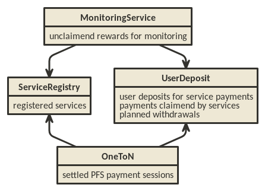

Smart Contracts for Raiden Services
###################################

Overview
========

The Raiden services (:ref:`MS` and :ref:`PFS`) require a set of smart contracts to function. There are two general smart contracts:

* UserDeposit
* ServiceRegistry

and one additional contract for each of the services

* MonitoringService, used as integral part of how the MS functions
* OneToN, a minimal one-to-N payment solution used to pay fees to the PFS

which depend on the former two contracts.

There might also be an additional contract to facilitate the onboarding of new Raiden users, which has been called "`Hub Contract`_" in some discussions. There are no detailed plans for that contract, yet.

.. _Hub Contract: https://github.com/raiden-network/spec/issues/120

.. _ServiceRegistry:

ServiceRegistry
===============

The ServiceRegistry provides a registry in which services have to register before becoming a full part of the Raiden services system. Services have to deposit RDN tokens in this contract for a successful registration. This avoids attacks using a large number of services and increases the incentive for service provider to not harm the Raiden ecosystem.

Requirements
------------

- Need to stake for these slots by the Raiden Service Providers (RSPs), but there will be no slashing
- RSPs must be allowed to withdraw the deposited stake after their registration ends
- An "auction" mechanism that allows for competition over those slots
- There must be a way for new RSPs to get a slot
- We want an easy MVP to get real user feedback after our release
- Need to provide a way of setting the minimal deposit amount - the cost of becoming an RSP should be high enough to deter users from double-spending IOUs
- We want to reduce the amount of work to be done, so try to avoid periodical deployments and / or coordination stakeholders
- There must be a way for other smart contracts to check if an address is registered as a service provider
- Avoid new implementations if possible
- The deployer should be able to choose whether it wants to control the parameters

Design
------------

In order to avoid periodical deployments, ServiceRegistry does not have a deadline for joining.  ServiceRegistry allows new deposits anytime.
The required amount of deposit (called the price) changes over time so as to regulate the inflow of the deposits.
The price movement depends only on the timing of incoming deposits.
Upon receiving new deposit, the price jumps by some ratio (called the bump ratio).
Otherwise the price decreases slowly following some exponential decay, dictated by the decay constant.

Use cases
------------

- Somebody who wants to provide services registers themselves as a RSP.
- Service smart contracts look up whether an Ethereum address is registered as a RSP.
- A registered RSP posts a URL.
- Users of services look up URLs of registered RSPs.
- Users of services choose one of the registered RSPs randomly.

States
------------

1. Before the deployment transaction, the address of ServiceRegistry has no code, and zero nonce.  The address might already control some ETH or tokens (which nobody can take out).
2. During the deployment transaction, ServiceRegistry can be already called by other contracts that are invoked by the constructor of ServiceRegistry.
3. After the deployment transaction a ServiceRegistry has the following entries in its state.

   a. ``controller`` the address that can change some parameters of ServiceRegistry
   b. ``set_price`` last recorded price
   c. ``set_price_at`` the timestamp when ``set_price`` was recorded
   d. ``decay_constant`` the number of seconds till the price decreases by roughly 1/2.7
   e. ``min_price`` the minimum price, under which the price does not decay
   f. ``price_bump_numerator`` and ``price_bump_denominator`` the ratio of the price dump when a deposit is made
   g. ``registration_duration`` the duration in seconds of a service registration (or its extension)
   h. ``deprecated`` non-zero value indicates that the controller has turned on the deprecation switch
   i. ``token`` the address of the ERC20 token account with which registration deposits are made
   j. ``service_valid_till`` the timestamp when the registration of every address expires (zero if the address has never made a deposit)
   k. ``urls`` the URL that a registered account submitted
   l. ``ever_made_deposits`` the list of addresses that have ever made deposits

Deployment
------------

Anybody (with enough ETH to cover the gas costs) can deploy a ServiceRegistry smart contract.

The deployer chooses

   * the token for registration
   * the controller
   * the initial price
   * the price bump ratio
   * the decay constant
   * the minimum price

The other entries start empty.

Deposit
------------

Anybody can register themselves as a service (with enough ETH to cover the gas costs, and with enough tokens).  The registration runs for the registration duration.  If they are already registered their registration extends by the registration duration.

Before calling ``deposit()``, the service provider candidate must have called ``approve()`` function on the ERC20 token smart contract, so that the ServiceRegistry can send tokens.  The approval must cover the current price.

The current price might be higher than what the service provider candidate has seen because another party might have made a deposit meanwhile.  The service provider candidate must set a limit amount, indicating the biggest amount of tokens it's willing to deposit.  If the current price is bigger than the limit amount, the service provider candidate still pays the gas costs in ETH, but its tokens stay.

If the service provider candidate approved more than the current price (both in the ERC20 token smart contract and in the limit amount parameter), its tokens are transferred into a newly created Deposit smart contract. The ServiceRegistry smart contract records the new deadline of the service provider's registration. The new deposits cannot be withdrawn until this deadline. After the deadline, the registered service provider can withdraw the deposit. The address of the newly created Deposit contract can be seen as the fourth parameter of ``RegisteredService(msg.sender, valid_till, amount, depo)``.  Extension of an existing registration does not affect the deposits made in the past. In other words, the old deposits can be withdrawn after the originally scheduled deadline.

In case the deposit is made successfully, the ServiceRegistry contract remembers the amount as ``set_price``, and the current timestamp as ``set_price_at``.

Setting a URL
-------------

A registered service provider can set a URL (with enough ETH to cover the gas costs).  If it has already set a URL, the new URL overwrites the old URL.

Setting the Deprecation Switch
------------------------------

The controller can at any time turn on the deprecation switch.  Once the deprecation switch is on, it cannot be turned off, no new deposits can be made, and the already made deposits can immediately be withdrawn.

Changing Parameters
-------------------

The controller can at any time change the parameters

* the price bump ratio
* the decay constant
* the minimum price
* the registration duration

When the parameters are changed, the ServiceRegistry contract calculates and records the current price using the old parameters. From then on, the price changes according to the new parameters.

UserDeposit
===========

The Raiden services will ask for payment in RDN. The Monitoring Service and the Pathfinding Service require deposits to be made in advance of service usage. These deposits are handled by the User Deposit Contract.
Usage of the deposit for payments is not safe from double spending, but measures can be taken to reduce the likelihood to acceptable levels. This is a good trade off as long as the money lost on double spending is less than the savings in gas cost.

Requirements
------------

- Users can deposit and withdraw tokens.
- Tokens can be deposited to the benefit of other users. This could facilitate onboarding of new Raiden users and allow a MS to defer the monitoring to another MS.
- Tokens can't be withdrawn immediately, but only after a certain delay. This allows services to claim their deserved payments before the withdraw takes place.
- Services can read the effective balance of a user (current balance - planned withdrawals)
- Service contracts are trusted and can claim tokens for the service providers.
- Services can listen to events which notify them of decreasing user balances. A service can then claim payments before double spending becomes too likely.

Use cases
---------

Monitoring Service rewards
^^^^^^^^^^^^^^^^^^^^^^^^^^
The MS is promised a reward for each settlement in which it took part on behalf of the non-closing participant. Before accepting a monitor request, the MS checks if enough tokens are deposited in the UDC. The MS that has submit the latest BP upon settlement will receive the promised tokens on it's UDC balance.

1-n payments
^^^^^^^^^^^^
The PFS will be paid with signed IOUs, roughly a simplified uRaiden adapted to 1-n payments. The IOU contains the amount of tokens that can be claimed from the signer's UDC balance. See `OneToN`_ for details.

.. _OneToN:

OneToN
======

Overview
--------

The OneToN contract handles payments for the PFS. It has been chosen with the
following properties in mind:

-  easy to implement
-  low initial gas cost even when fees are paid to many PFSs
-  a certain risk of double spends is accepted

The concept is based on the idea to use a user's single deposit in the
UDC as a security deposit for off-chain payments to all PFSs. The client
sends an IOU consisting of (sender, receiver, amount, expiration,
signature) to the PFS with every path finding request. The PFS verifies
the IOU and checks that ``amount >= prev_amount + pfs_fee``. At any
time, the PFS can claim the payment by submitting the IOU on-chain.
Afterwards, no further IOU with the same (sender, receiver, expiration)
can be claimed.

Related:

-  `https://github.com/raiden-network/team/issues/257`_
-  `https://github.com/raiden-network/team/issues/256`_
-  `https://gist.github.com/heikoheiko/214dbbd954e0f97e0e13b2fefdc7c753`_

.. _`https://github.com/raiden-network/team/issues/257`: https://github.com/raiden-network/team/issues/257
.. _`https://github.com/raiden-network/team/issues/256`: https://github.com/raiden-network/team/issues/256
.. _`https://gist.github.com/heikoheiko/214dbbd954e0f97e0e13b2fefdc7c753`: https://gist.github.com/heikoheiko/214dbbd954e0f97e0e13b2fefdc7c753

Requirements
------------

-  low latency (<1s)
-  reliability, high probability of success (P > 0.99)
-  low cost overhead (<5% of transferred amount)
-  low fraud rate (< 3%, i.e. some fraud is tolerable)
-  can be implemented quickly

.. _pfs_payment:

Communication between client and PFS
------------------------------------

When requesting a route, the IOU is added as new JSON object to
the :ref:`existing parameters <path_args>` when requesting paths. The IOU object has the following properties:

+---------------------+------------+---------------------------------------------------------+
| Field Name          | Field Type | Description                                             |
+=====================+============+=========================================================+
| sender              | address    | Sender of the payment (Ethereum address of client)      |
+---------------------+------------+---------------------------------------------------------+
| receiver            | address    | Receiver of the payment (Ethereum address of PFS)       |
+---------------------+------------+---------------------------------------------------------+
| amount              | uint256    | Total amount of tokens transferred to the receiver      |
|                     |            | within this session (sender, receiver, expiration_block)|
+---------------------+------------+---------------------------------------------------------+
| expiration_block    | uint256    | Last block in which the IOU can be claimed              |
+---------------------+------------+---------------------------------------------------------+
| one_to_n_address    | address    | The OneToN contract for which this IOU is valid         |
+---------------------+------------+---------------------------------------------------------+
| chain_id            | uint256    | Chain identifier as defined in EIP155                   |
+---------------------+------------+---------------------------------------------------------+
| signature           | bytes      | Signature of the payment arguments [#sig]_              |
+---------------------+------------+---------------------------------------------------------+

The PFS then thoroughly checks the IOU:

-  Is the PFS the receiver?
-  Did the amount increase enough to make the request profitable for the
   PFS (``amount >= prev_amount + pfs_fee``)
-  Is ``expiration_block`` far enough in the future to potentially
   accumulate a reasonable amount of fees and claim the payment
-  Is the IOU for (sender, receiver, expiration) still unclaimed
-  Did the client create too many small IOU instead of increasing the
   value of an existing one? This would make claiming the IOU
   unprofitable for the PFS
-  Is the signature valid
-  Is the deposit much larger than ``amount``

If one of the conditions is not met, a corresponding error message is
returned and the client can try to submit a request with a proper IOU or
try a different PFS. Otherwise, the PFS returns the requested routes as
described in the current spec and saves the latest IOU for this (sender,
expiration_block).

.. [#sig] The signature is calculated by
          ::

               ecdsa_recoverable(
                   privkey,
                   sha3_keccak("\x19Ethereum Signed Message:\n188"
                               || one_to_n_address || chain_id || uint256(5)
                               || sender || receiver || amount || expiration_block)
               )

          You can use ``raiden_contracts.utils.sign_one_to_n_iou`` to generate such a signature.

Claiming the IOU
----------------

A OneToN contract (OTNC) which is trusted by the UDC accepts IOUs (see
table above for parameters) and uses the UDC to transfer ``amount`` from
``sender`` to ``receiver``. The OTNC stores a mapping
``hash(receiver, sender, expiration_block) => expiration_block`` to make
sure that each IOU can only be claimed once. To make claims more gas
efficient, multiple claims can be done in a single transaction and
expired claims can be removed from the storage. ``receiver`` has to be
registered in the ServiceRegistry, or otherwise the claiming fails.

Expiration
----------

Having the field ``expiration_block`` as part of the IOU serves multiple
purposes:

-  Combined with the ``sender`` and ``receiver`` fields it identifies a
   single payment session. Under this identifier, multiple payments are
   aggregated by continuously increasing the ``amount`` and only a
   single on-chain transaction is needed to claim the total payment sum.
   After claiming, the identifier is stored on-chain and used to prevent
   the receiver from claiming the same payments, again.
-  When old IOUs have expired (``current_block > expiration_block``),
   the sender can be sure that he won't have to pay this IOU. So after
   waiting for expiry, the sender knows that IOUs which have been lost
   for some reason (e.g. disk failure) won't be redeemed and does not
   have to prepare for unpredictable claims of very old IOUs.
-  Entries can be deleted from the
   ``hash(receiver, sender, expiration_block) => expiration_block``
   mapping which is used to prevent double claims after expiry. This
   frees blockchain storage and thereby reduces gas costs.

Double Spending
---------------

Since the same deposit is used for payments to multiple parties, it is
possible that the deposit is drained before each party has been paid.
This is an accepted trade-off, because the amounts are small and low gas
costs are more important, as long as the actual double spending does not
reach a high level. To somewhat reduce the risks of double spends, the
following precautions are taken:

-  Users can't immediately withdraw tokens from the UDC. They first have
   to announce their intention and then wait until a withdraw delay has
   elapsed.
-  The PFS demands a higher deposit than it's currently owed ``amount``
   to give it some safety margin when other parties claim tokens
-  Only PFSs registered in the ServiceRegistry are allowed to claim IOUs. This is
   important because claims allow circumventing the UDC's withdraw
   delay.

A user and a PFS can theoretically collude to quickly withdraw the
complete deposit (via a claim) before other services are paid. This
should be unlikely due to the following aspects:

-  The savings achieved by cheating the other services are low compared
   to the coordination cost for the collusion
-  The PFS is itself a party receiving payments of services and does not
   want to promote cheating against services
-  If this becomes widespread, cheating users can theoretically be
   blacklisted by PFSs. This will require them to close their existing
   channels and reopen new channels at a cost which will most likely be
   higher than the profit gained by cheating

MonitoringService
=================

The :ref:`MS` submits an up-to-date :term:`balance proof` on behalf of users who are offline when a channel is closed to prevent them from losing tokens. This could be done without a dedicated contract by calling `TokenNetwork.updateNonClosingBalanceProof <update-channel>` but then the MS would not be able to claim a reward for its work.
To handle the rewards, the MonitoringService contract provides two functions. ``monitor()`` for wrapping `updateNonClosingBalanceProof` and creating the reward and ``claimReward()`` for claiming the reward after the settlement. ``monitor()`` only works for service providers that are registered in ServiceRegistry:

.. autosolcontract:: MonitoringService
    :members: monitor, claimReward
