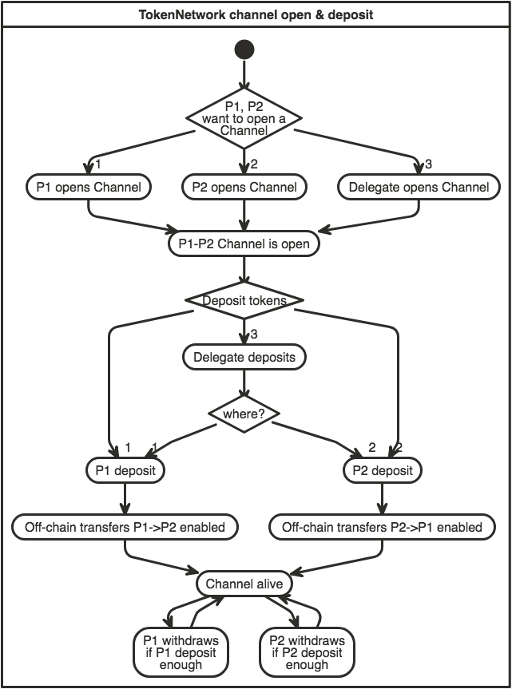
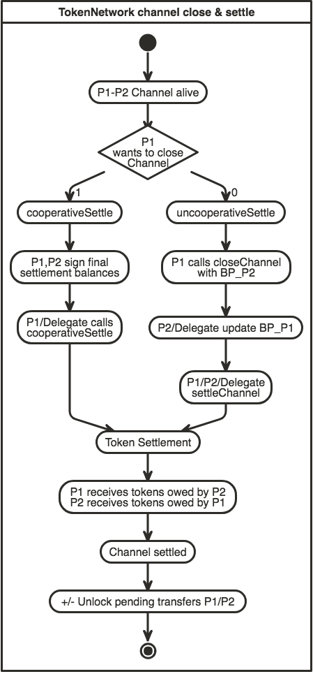
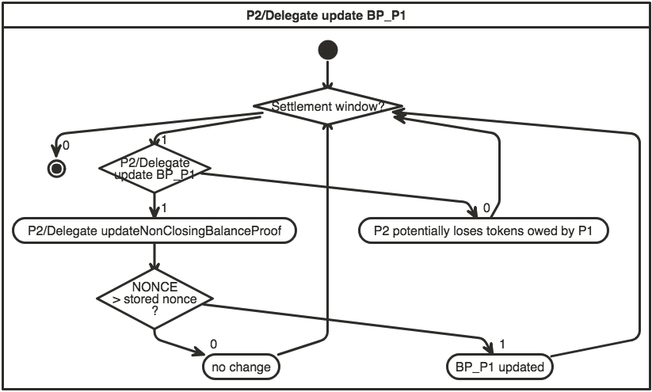
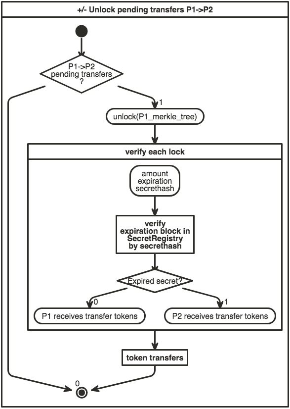

Raiden Network Smart Contracts Specification
############################################

Overview
========

This is the specification document for the Solidity smart contracts required for building the Raiden Network. All functions, their signatures, and their semantics.

General Requirements
====================

Secure
------

- A ``participant`` ``MUST NOT`` be able to steal funds. Therefore, a participant ``MUST NOT`` receive more tokens than he is entitled to, after calculating his final balance, unless this is due to his ``partner``'s attempt to cheat.
- A participant ``MUST`` be able to eventually retrieve his tokens from the channel, regardless of his partner's availability in the network.
- The ``sum of the final balances`` of the two channel participants, after the channel lifecycle has ended, ``MUST NOT`` be greater than the entire channel deposit available at settlement time.
- The signed messages ``MUST`` be non malleable.
- A participant ``MUST NOT`` be able to change the state of a channel by using a signed message from an old and settled channel with the same ``partner`` or from another channel.

Privacy
-------

- A participant's payment pattern in time ``MUST NOT`` be public on-chain (smart contracts only know about the final balance proofs, not all the intermediary ones).
- Participant addresses can be public.
- The final transferred amounts of the two participants can be public.
- The channel deposit can be public.

Fast
----

- It must provide means to do faster transfers (off-chain transaction)

Cheap
-----

- Gas usage optimization is a target

Project Requirements
====================

- The system must work with the most popular token standards (e.g. ERC20).
- There must not be a way for a single party to hold other user’s tokens hostage, therefore the system must hold in escrow any tokens that are deposited in a channel.
- Losing funds as a penalty is not considered stealing, but must be clearly documented.
- The system must support smart locks.
- The system must expose the network graph. Clients have to collect events in order to derive the network graph.

Data structures
===============

.. Note::
    The signed message format used in the data structures below is of this format:
    ``ecdsa_recoverable(privkey, keccak256("\x19Ethereum Signed Message:\n" || message_length || message))``

    Where:

    - ``message_length``: String of the length of the actual message to be signed in decimal representation (not null-terminated).
    - ``message = token_network_address || chain_id || message_type_id || message_specific_data``
    - ``message_type_id`` has a different value depending on the type of message signed

    This is compatible with https://github.com/ethereum/wiki/wiki/JSON-RPC#eth_sign and https://github.com/ethereum/EIPs/blob/master/EIPS/eip-191.md.
    
    Message content is tightly packed as described here: https://solidity.readthedocs.io/en/v0.4.24/abi-spec.html#abi-packed-mode.

.. _balance-proof-onchain:

Balance Proof
-------------

Onchain Balance Proof is generated by clients from :ref:`Offchain Balance Proofs <balance-proof-offchain>`.

::

    ecdsa_recoverable(privkey, sha3_keccak("\x19Ethereum Signed Message:\n212" || token_network_address || chain_id || message_type_id || channel_identifier || balance_hash || nonce || additional_hash))

Fields
^^^^^^

+-----------------------+------------+---------------------------------------------------------------------------------------------+
| Field Name            | Field Type | Description                                                                                 |
+=======================+============+=============================================================================================+
|  signature_prefix     | string     | ``\x19Ethereum Signed Message:\n``                                                          |
+-----------------------+------------+---------------------------------------------------------------------------------------------+
|  message_length       | string     | ``212`` = length of message = ``20 + 32 + 32 + 32 + 32 + 32 + 32``                          |
+-----------------------+------------+---------------------------------------------------------------------------------------------+
| token_network_address | address    | Address of the TokenNetwork contract                                                        |
+-----------------------+------------+---------------------------------------------------------------------------------------------+
| chain_id              | uint256    | Chain identifier as defined in EIP155                                                       |
+-----------------------+------------+---------------------------------------------------------------------------------------------+
| message_type_id       | uint256    | ``1`` = message type identifier                                                             |
+-----------------------+------------+---------------------------------------------------------------------------------------------+
|  channel_identifier   | uint256    | Channel identifier inside the TokenNetwork contract                                         |
+-----------------------+------------+---------------------------------------------------------------------------------------------+
|  balance_hash         | bytes32    | Balance data hash                                                                           |
+-----------------------+------------+---------------------------------------------------------------------------------------------+
|  nonce                | uint256    | Strictly monotonic value used to order transfers. The nonce starts at 1                     |
+-----------------------+------------+---------------------------------------------------------------------------------------------+
|  additional_hash      | bytes32    | Hash of the offchain message that contains the balance proof (possibly application-specific |
|                       |            | metadata can be also hashed in here)                                                        |
+-----------------------+------------+---------------------------------------------------------------------------------------------+
|  signature            | bytes      | Elliptic Curve 256k1 signature on the above data                                            |
+-----------------------+------------+---------------------------------------------------------------------------------------------+

Balance Data Hash
^^^^^^^^^^^^^^^^^

``balance_hash`` = ``keccak256(transferred_amount || locked_amount || locksroot)``

+------------------------+------------+---------------------------------------------------------------------------------------+
| Field Name             | Field Type |  Description                                                                          |
+========================+============+=======================================================================================+
|  transferred_amount    | uint256    | Monotonically increasing amount of tokens transferred by a channel participant        |
+------------------------+------------+---------------------------------------------------------------------------------------+
|  locked_amount         | uint256    | Total amount of tokens locked in pending transfers                                    |
+------------------------+------------+---------------------------------------------------------------------------------------+
|  locksroot             | bytes32    | Hash of all pending locks encoded and concatenated                                    |
+------------------------+------------+---------------------------------------------------------------------------------------+

.. _balance-proof-update-onchain:

Balance Proof Update
--------------------

::

    ecdsa_recoverable(privkey, sha3_keccak("\x19Ethereum Signed Message:\n277" || token_network_address || chain_id || message_type_id || channel_identifier || balance_hash || nonce || additional_hash || closing_signature))

- ``closing_signature`` is the closing participant's signature on the :ref:`balance proof <balance-proof-onchain>`

Fields
^^^^^^

+-----------------------+------------+--------------------------------------------------------------------------------------------+
| Field Name            | Field Type | Description                                                                                |
+=======================+============+============================================================================================+
|  signature_prefix     | string     | ``\x19Ethereum Signed Message:\n``                                                         |
+-----------------------+------------+--------------------------------------------------------------------------------------------+
|  message_length       | string     | ``277`` = length of message = ``20 + 32 + 32 + 32 + 32 + 32 + 32 + 65``                    |
+-----------------------+------------+--------------------------------------------------------------------------------------------+
| token_network_address | address    | Address of the TokenNetwork contract                                                       |
+-----------------------+------------+--------------------------------------------------------------------------------------------+
| chain_id              | uint256    | Chain identifier as defined in EIP155                                                      |
+-----------------------+------------+--------------------------------------------------------------------------------------------+
| message_type_id       | uint256    | ``2`` = message type identifier                                                            |
+-----------------------+------------+--------------------------------------------------------------------------------------------+
|  channel_identifier   | uint256    | Channel identifier inside the TokenNetwork contract                                        |
+-----------------------+------------+--------------------------------------------------------------------------------------------+
|  balance_hash         | bytes32    | Balance data hash                                                                          |
+-----------------------+------------+--------------------------------------------------------------------------------------------+
|  nonce                | uint256    | Strictly monotonic value used to order transfers. The nonce starts at 1                    |
+-----------------------+------------+--------------------------------------------------------------------------------------------+
|  additional_hash      | bytes32    | Hash of the offchain message that contains the balance proof (possibly application-specific|
|                       |            | metadata can be also hashed in here)                                                       |
+-----------------------+------------+--------------------------------------------------------------------------------------------+
|  closing_signature    | bytes      | Elliptic Curve 256k1 balance proof signature from the closing participant                  |
+-----------------------+------------+--------------------------------------------------------------------------------------------+
|  signature            | bytes      | Elliptic Curve 256k1 signature on the above data from the non-closing participant          |
+-----------------------+------------+--------------------------------------------------------------------------------------------+

.. _withdraw-proof:

Withdraw Proof
--------------

Data required by the smart contracts to allow a user to withdraw funds from a channel without closing it. It contains the withdraw proof which is signed by both participants.

Signatures must be valid and are defined as:

::

    ecdsa_recoverable(privkey, sha3_keccak("\x19Ethereum Signed Message:\n168" || token_network_address || chain_id || message_type_id || channel_identifier || participant_address || total_withdraw))

Invariants
^^^^^^^^^^

- ``total_withdraw`` is strictly monotonically increasing. This is required for protection against replay attacks with old withdraw proofs.

Fields
^^^^^^

+------------------------+------------+---------------------------------------------------------------------------------+
| Field Name             | Field Type |  Description                                                                    |
+========================+============+=================================================================================+
|  signature_prefix      | string     | ``\x19Ethereum Signed Message:\n``                                              |
+------------------------+------------+---------------------------------------------------------------------------------+
|  message_length        | string     | ``168`` = length of message = ``20 + 32 + 32 + 32 + 20 + 32``                   |
+------------------------+------------+---------------------------------------------------------------------------------+
| token_network_address  | address    | Address of the TokenNetwork contract                                            |
+------------------------+------------+---------------------------------------------------------------------------------+
| chain_id               | uint256    | Chain identifier as defined in EIP155                                           |
+------------------------+------------+---------------------------------------------------------------------------------+
| message_type_id        | uint256    | ``3`` = message type identifier                                                 |
+------------------------+------------+---------------------------------------------------------------------------------+
|  channel_identifier    | uint256    | Channel identifier inside the TokenNetwork contract                             |
+------------------------+------------+---------------------------------------------------------------------------------+
|  participant_address   | address    | Channel participant, who withdraws the tokens                                   |
+------------------------+------------+---------------------------------------------------------------------------------+
|  total_withdraw        | uint256    | Total amount of tokens that participant_address has withdrawn from the channel  |
+------------------------+------------+---------------------------------------------------------------------------------+
|  participant_signature | bytes      | Elliptic Curve 256k1 signature of the participant on the withdraw data          |
+------------------------+------------+---------------------------------------------------------------------------------+
|  partner_signature     | bytes      | Elliptic Curve 256k1 signature of the partner on the withdraw data              |
+------------------------+------------+---------------------------------------------------------------------------------+

.. _cooperative-settle-proof:

Cooperative Settle Proof
------------------------

Data required by the smart contracts to allow the two channel participants to close and settle the channel instantly, in one transaction. It contains the cooperative settle proof which is signed by both participants.
Signatures must be valid and are defined as:

::

    ecdsa_recoverable(privkey, sha3_keccak("\x19Ethereum Signed Message:\n220" || token_network_address || chain_id || message_type_id || channel_identifier || participant1_address || participant1_balance || participant2_address || participant2_balance))

Fields
^^^^^^

+------------------------+------------+--------------------------------------------------------------------------------+
| Field Name             | Field Type |  Description                                                                   |
+========================+============+================================================================================+
|  signature_prefix      | string     | ``\x19Ethereum Signed Message:\n``                                             |
+------------------------+------------+--------------------------------------------------------------------------------+
|  message_length        | string     | ``220`` = length of message = ``20 + 32 + 32 + 32 + 20 + 32 + 20 + 32``        |
+------------------------+------------+--------------------------------------------------------------------------------+
| token_network_address  | address    | Address of the TokenNetwork contract                                           |
+------------------------+------------+--------------------------------------------------------------------------------+
| chain_id               | uint256    | Chain identifier as defined in EIP155                                          |
+------------------------+------------+--------------------------------------------------------------------------------+
| message_type_id        | uint256    | ``4`` = message type identifier                                                |
+------------------------+------------+--------------------------------------------------------------------------------+
|  channel_identifier    | uint256    | Channel identifier inside the TokenNetwork contract                            |
+------------------------+------------+--------------------------------------------------------------------------------+
|  participant1_address  | address    | One of the channel participants                                                |
+------------------------+------------+--------------------------------------------------------------------------------+
|  participant1_balance  | uint256    | Amount of tokens that participant1_address will receive after settling         |
+------------------------+------------+--------------------------------------------------------------------------------+
|  participant2_address  | address    | The other channel participant                                                  |
+------------------------+------------+--------------------------------------------------------------------------------+
|  participant2_balance  | uint256    | Amount of tokens that participant2_address will receive after settling         |
+------------------------+------------+--------------------------------------------------------------------------------+
|  participant1_signature| bytes      | Elliptic Curve 256k1 signature of participant1 on the message data             |
+------------------------+------------+--------------------------------------------------------------------------------+
|  participant2_signature| bytes      | Elliptic Curve 256k1 signature of participant2 on the message data             |
+------------------------+------------+--------------------------------------------------------------------------------+

Smart Contract Functional Decomposition
=======================================

TokenNetworkRegistry Contract
-----------------------------

This contract creates and remembers a TokenNetwork contract for an ERC20 Token.  Raiden clients listen to ``TokenNetworkCreated`` events so they can notice when this contract deploys a new ``TokenNetwork``.

Attributes:

- ``address public secret_registry_address``
- ``uint256 public chain_id``
- ``uint256 public settlement_timeout_min``
- ``uint256 public settlement_timeout_max``

**Register a token**

Deploy a new ``TokenNetwork`` contract and add its address in the registry.

::

    function createERC20TokenNetwork(address token_address) public

::

    event TokenNetworkCreated(address token_address, address token_network_address)

- ``token_address``: address of the Token contract.
- ``token_network_address``: address of the newly deployed ``TokenNetwork`` contract.
- ``settlement_timeout_min``: Minimum settlement timeout to be used in every ``TokenNetwork``
- ``settlement_timeout_max``: Maximum settlement timeout to be used in every ``TokenNetwork``

.. Note::
    It also provides the ``SecretRegistry`` contract address to the ``TokenNetwork`` constructor.

TokenNetwork Contract
---------------------

Provides the interface to interact with payment channels. The channels can only transfer the type of token that this contract defines through ``token_address``.

.. _channel-identifier:

:term:`Channel Identifier` is currently defined as ``uint256``, a global monotonically increasing counter of all the channels inside a ``TokenNetwork``.

.. Note::
    A ``channel_identifier`` value of ``0`` is not a valid value for an active channel. The counter starts at ``1``.

**Attributes**

- ``Token public token``
- ``SecretRegistry public secret_registry;``
- ``uint256 public chain_id``

**Getters**

.. _get-channel-identifier:

We currently limit the number of channels between two participants to one. Therefore, a pair of addresses can have at most one ``channel_identifier``. The ``channel_identifier`` will be ``0`` if the channel does not exist.

::

    function getChannelIdentifier(address participant, address partner)
        view
        public
        returns (uint256 channel_identifier)

.. _get-channel-info:

::

    function getChannelInfo(
        uint256 channel_identifier,
        address participant1,
        address participant2
    )
        view
        external
        returns (uint256 settle_block_number, ChannelState state)

- ``channel_identifier``: :term:`Channel identifier` assigned by the current contract.
- ``participant1``: Ethereum address of a channel participant.
- ``participant2``: Ethereum address of the other channel participant.
- ``state``: Channel state. It can be ``NonExistent`` - ``0``, ``Opened`` - ``1``, ``Closed`` - ``2``, ``Settled`` - ``3``, ``Removed`` - ``4``.
- ``settle_block_number``: the number of blocks in the :term:`challenge period` if ``state`` is ``Opened``; the block number after which settleChannel() can succeed if ``state`` is ``Closed``; 0 otherwise.

.. Note::
    Channel state ``Settled`` means the channel was settled and channel data removed. However, there is still data remaining in the contract for calling ``unlock`` - for at least one participant.

    Channel state ``Removed`` means that no channel data and no ``unlock`` data remain in the contract.

.. _get-channel-participant-info:

::

    function getChannelParticipantInfo(
            uint256 channel_identifier,
            address participant,
            address partner
    )
        view
        external
        returns (
            uint256 deposit,
            uint256 withdrawn_amount,
            bool is_the_closer,
            bytes32 balance_hash,
            uint256 nonce,
            bytes32 locksroot,
            uint256 locked_amount
        )

- ``channel_identifier``: :term:`Channel identifier` assigned by the current contract.
- ``participant``: Ethereum address of a channel participant.
- ``partner``: Ethereum address of the other channel participant.
- ``deposit``: The amount of tokens that the ``participant`` has deposited through :ref:`setTotalDeposit() <deposit-channel>`. Can be ``>=0`` after the channel has been opened. Must be ``0`` when the channel is in ``Settled`` or ``Removed`` state.
- ``withdrawn_amount``: Can be ``>=0`` after the channel has been opened. Must be ``0`` when the channel is in ``Settled`` or ``Removed`` state.
- ``is_the_closer``: Can be ``true`` if the channel is in ``Closed`` state and if ``participant`` closed the channel. Must be ``false`` otherwise.
- ``balance_hash``: Can be set when the channel is in ``Closed`` state. Must be ``0`` otherwise.
- ``nonce``: Can be set when the channel is in a ``Closed`` state. Must be ``0`` otherwise.
- ``locksroot``: Can be set when the channel is in a ``Settled`` state. Must be ``0`` otherwise.
- ``locked_amount``: Can be set when the channel is in a ``Settled`` state. Must be ``0`` otherwise.

.. _open-channel:

**Open a channel**

Opens a channel between ``participant1`` and ``participant2`` and sets the challenge period of the channel.

::

    function openChannel(address participant1, address participant2, uint256 settle_timeout) public returns (uint256 channel_identifier)

::

    event ChannelOpened(
        uint256 indexed channel_identifier,
        address indexed participant1,
        address indexed participant2,
        uint256 settle_timeout
    );

- ``channel_identifier``: :term:`Channel identifier` assigned by the current contract.
- ``participant1``: Ethereum address of a channel participant.
- ``participant2``: Ethereum address of the other channel participant.
- ``settle_timeout``: Number of blocks that need to be mined between a call to ``closeChannel`` and ``settleChannel``.

.. Note::
    Anyone can open a channel between ``participant1`` and ``participant2``.

    A participant or delegate ``MUST`` be able to ``open`` a channel with another participant if one does not exist.

    A participant ``MUST`` be able to ``reopen`` a channel with another participant if there were previous channels opened between them and then settled.

.. _deposit-channel:

**Fund a channel**

Deposit more tokens into a channel. This will only increase the deposit of one of the channel participants: the ``participant``.

::

    function setTotalDeposit(
        uint256 channel_identifier,
        address participant,
        uint256 total_deposit,
        address partner
    )
        public

::

    event ChannelNewDeposit(
        uint256 indexed channel_identifier,
        address indexed participant,
        uint256 total_deposit
    );

- ``participant``: Ethereum address of a channel participant whose deposit will be increased.
- ``total_deposit``: Total amount of tokens that the ``participant`` will have as ``deposit`` in the channel.
- ``partner``: Ethereum address of the other channel participant, used for computing ``channel_identifier``.
- ``channel_identifier``: :term:`Channel identifier` assigned by the current contract.
- ``deposit``: The total amount of tokens deposited in a channel by a participant.

.. Note::
    Allowed to be called multiple times. Can be called by anyone.

    Before calling ``setTotalDeposit()``, the caller needs to send the ``approve`` transaction on the ERC20 token contract so that the ``TokenNetwork`` contract can make the token transfer for the channel deposit.

    This function is idempotent. The UI and internal smart contract logic has to make sure that the amount of tokens actually transferred is the difference between ``total_deposit`` and the ``deposit`` at transaction time.

    A participant or a delegate ``MUST`` be able to deposit more tokens into a channel, regardless of his partner's availability.

.. _withdraw-channel:

**Withdraw tokens from a channel**

.. Warning::
    ``setTotalWithdraw`` function is currently commented out and is not available.

Allows a channel participant to withdraw tokens from a channel without closing it. Can be called by anyone. Can only be called once per each signed withdraw proof.

::

    function setTotalWithdraw(
        uint256 channel_identifier,
        address participant,
        uint256 total_withdraw,
        bytes participant_signature,
        bytes partner_signature
    )
        external

::

    event ChannelWithdraw(
        uint256 indexed channel_identifier,
        address indexed participant,
        uint256 total_withdraw
    );

- ``channel_identifier``: :term:`Channel identifier` assigned by the current contract.
- ``participant``: Ethereum address of a channel participant who will receive the tokens withdrawn from the channel.
- ``total_withdraw``: Total amount of tokens that are marked as withdrawn from the channel during the channel lifecycle.
- ``participant_signature``: Elliptic Curve 256k1 signature of the channel ``participant`` on the :term:`withdraw proof` data.
- ``partner_signature``: Elliptic Curve 256k1 signature of the channel ``partner`` on the :term:`withdraw proof` data.

.. Note::
    A ``participant`` ``MUST NOT`` be able to withdraw tokens from the channel without his ``partner``'s signature.
    A ``participant`` ``MUST NOT`` be able to withdraw more tokens than his available balance ``AB``, as defined in the :ref:`settlement algorithm <settlement-algorithm>`.
    A ``participant`` ``MUST NOT`` be able to withdraw more tokens than the available channel deposit ``TAD``, as defined in the :ref:`settlement algorithm <settlement-algorithm>`.

.. _close-channel:

**Close a channel**

Allows a channel participant to close the channel. The channel cannot be settled before the challenge period has ended.

::

    function closeChannel(
        uint256 channel_identifier,
        address non_closing_participant,
        address closing_participant,
        // The next four arguments form a balance proof.
        bytes32 balance_hash,
        uint256 nonce,
        bytes32 additional_hash,
        bytes memory non_closing_signature,
        bytes memory closing_signature
    )
        public

::

    event ChannelClosed(uint256 indexed channel_identifier, address indexed closing_participant);

- ``channel_identifier``: :term:`Channel identifier` assigned by the current contract.
- ``partner``: Channel partner of the participant who calls the function.
- ``balance_hash``: Hash of the balance data ``keccak256(transferred_amount, locked_amount, locksroot)``

    - ``transferred_amount``: The monotonically increasing counter of the partner's amount of tokens sent.
    - ``locked_amount``: The sum of the all the tokens that correspond to the the pending locks.
    - ``locksroot``: Hash of all pending locks for the partner.
- ``nonce``: Strictly monotonic value used to order transfers.
- ``additional_hash``: Computed from the message. Used for message authentication.
- ``non_closing_signature``: Elliptic Curve 256k1 signature of the channel partner on the :term:`balance proof` data.
- ``closing_signature``: Elliptic Curve 256k1 signature of the closing party on the :term:`balance proof update` data.
- ``closing_participant``: Ethereum address of the channel participant who calls this contract function.

.. Note::
    Only a participant may close the channel.

    A participant ``MUST`` be able to set his partner's balance proof on-chain, in order to be used in the settlement algorithm.

    Only a valid signed :term:`balance proof` from the channel ``partner`` ``MUST`` be accepted. This :term:`balance proof` sets the amount of tokens owed to the ``participant`` by the channel ``partner``.

    Only a valid signed :term:`balance proof update` from the channel ``participant`` ``MUST`` be accepted. This signature on the :term:`balance proof update` (with message ID being ``1``) shows the intention of the ``participant`` to close the channel.

    A ``participant`` ``MUST`` be able to close a channel regardless of his ``partner``'s availability (online/offline status).

.. _update-channel:

**Update the balance proof counting towards the non-closing participant**

Called after a channel has been closed. Can be called by any Ethereum address and allows the non-closing participant to provide the latest :term:`balance proof` from the closing participant. This modifies the stored state for the closing participant.

::

    function updateNonClosingBalanceProof(
        uint256 channel_identifier,
        address closing_participant,
        address non_closing_participant,
        bytes32 balance_hash,
        uint256 nonce,
        bytes32 additional_hash,
        bytes closing_signature,
        bytes non_closing_signature
    )
        external

::

    event NonClosingBalanceProofUpdated(
        uint256 indexed channel_identifier,
        address indexed closing_participant,
        uint256 nonce
    );

- ``channel_identifier``: Channel identifier assigned by the current contract.
- ``closing_participant``: Ethereum address of the channel participant who closed the channel.
- ``non_closing_participant``: Ethereum address of the channel participant who is updating the balance proof data.
- ``balance_hash``: Hash of the balance data
- ``nonce``: Strictly monotonic value used to order transfers.
- ``additional_hash``: Computed from the offchain message. Used for message authentication. Potentially useful for hashing in other application-specific metadata.
- ``closing_signature``: Elliptic Curve 256k1 signature of the closing participant on the :term:`balance proof` data.
- ``non_closing_signature``: Elliptic Curve 256k1 signature of the non-closing participant on the :term:`balance proof` data.
- ``closing_participant``: Ethereum address of the participant who closed the channel.

.. Note::
    Can be called by any Ethereum address due to the requirement of providing signatures from both channel participants.

    The ``participant`` who did not close the channel ``MUST`` be able to send to the :term:`Token Network` contract his ``partner``'s :term:`balance proof`, in order to retrieve his tokens.

    Only a valid signed :term:`balance proof` from the channel's ``closing participant`` (the other channel participant) ``MUST`` be accepted. This :term:`balance proof` sets the amount of tokens owed to the ``non-closing participant`` by the ``closing participant``.

    Only a valid signed `balance proof update`__  ``MUST`` be accepted. This update is a confirmation from the ``non-closing participant`` that the contained :term:`balance proof` can be set on his behalf.

    __ balance-proof-update-onchain_

.. _settle-channel:

**Settle channel**

Settles the channel by transferring the amount of tokens each participant is owed. We need to provide the entire balance state because we only store the balance data hash when closing the channel and updating the non-closing participant balance.

.. Note::
    For an explanation of how the settlement values are computed, please check :ref:`Protocol Values and Settlement Algorithm Analysis <settlement-algorithm>`

::

    function settleChannel(
        uint256 channel_identifier,
        address participant1,
        uint256 participant1_transferred_amount,
        uint256 participant1_locked_amount,
        bytes32 participant1_locksroot,
        address participant2,
        uint256 participant2_transferred_amount,
        uint256 participant2_locked_amount,
        bytes32 participant2_locksroot
    )
        public

::

    event ChannelSettled(
        uint256 indexed channel_identifier,
        uint256 participant1_amount,
        uint256 participant2_amount
    );

- ``channel_identifier``: :term:`Channel identifier` assigned by the current contract.
- ``participant1``: Ethereum address of one of the channel participants.
- ``participant1_transferred_amount``: The monotonically increasing counter of the amount of tokens sent by ``participant1`` to ``participant2``.
- ``participant1_locked_amount``: The sum of the all the tokens that correspond to the locks (pending transfers sent by ``participant1`` to ``participant2``) contained in the pending lock list.
- ``participant1_locksroot``: Hash of all pending lock lockhashes (pending transfers sent by ``participant1`` to ``participant2``).
- ``participant2``: Ethereum address of the other channel participant.
- ``participant2_transferred_amount``: The monotonically increasing counter of the amount of tokens sent by ``participant2`` to ``participant1``.
- ``participant2_locked_amount``: The sum of the all the tokens that correspond to the locks (pending transfers sent by ``participant2`` to ``participant1``) contained in the pending lock list.
- ``participant2_locksroot``: Hash of the all pending lock lockhashes (pending transfers sent by ``participant2`` to ``participant1``).
- ``participant1_amount``: the amount of tokens sent to ``participant1`` at the end of the settlement.
- ``participant2_amount``: the amount of tokens sent to ``participant2`` at the end of the settlement.

.. Note::
    Can be called by anyone after a channel has been closed and the challenge period is over.

    We expect the ``cooperativeSettle`` function to be used as the go-to way to end a channel's life. However, this would require both Raiden nodes to be online at the same time. For cases where a Raiden node is not online, the uncooperative settle will be used (``closeChannel`` -> ``updateNonClosingBalanceProof`` -> ``settleChannel`` -> ``unlock``). This is why the ``settleChannel`` transaction ``MUST`` never fail from internal errors - tokens ``MUST`` not remain locked inside the contract without a way of retrieving them. ``settleChannel`` can only receive balance proof values that correspond to the stored ``balance_hash``. Therefore, any overflows or underflows (or other potential causes of failure ) ``MUST`` be handled graciously.

    We currently enforce an ordering of the participant data based on the following rule: ``participant2_transferred_amount + participant2_locked_amount >= participant1_transferred_amount + participant1_locked_amount``. This is an artificial rule to help the settlement algorithm handle overflows and underflows easier, without failing the transaction. Therefore, calling ``settleChannel`` with wrong input arguments order must be the only case when the transaction can fail.

.. _cooperative-settle-channel:

**Cooperatively close and settle a channel**

.. Warning::
    ``cooperativeSettle`` function is currently commented out and is not available.

Allows the participants to cooperate and provide both of their balances and signatures. This closes and settles the channel immediately, without triggering a challenge period.

::

    function cooperativeSettle(
        uint256 channel_identifier,
        address participant1_address,
        uint256 participant1_balance,
        address participant2_address,
        uint256 participant2_balance,
        bytes participant1_signature,
        bytes participant2_signature
    )
        public

- ``channel_identifier``: :term:`Channel identifier` assigned by the current contract
- ``participant1_address``: Ethereum address of one of the channel participants.
- ``participant1_balance``: Channel balance of ``participant1_address``.
- ``participant2_address``: Ethereum address of the other channel participant.
- ``participant2_balance``: Channel balance of ``participant2_address``.
- ``participant1_signature``: Elliptic Curve 256k1 signature of ``participant1`` on the :term:`cooperative settle proof` data.
- ``participant2_signature``: Elliptic Curve 256k1 signature of ``participant2`` on the :term:`cooperative settle proof` data.

.. Note::
    Emits the ChannelSettled event.

    A ``participant`` ``MUST NOT`` be able to cooperatively settle a channel without his ``partner``'s signature on the agreed upon balances.

    Can be called by a third party because both signatures are required.

.. _unlock-channel:

**Unlock lock**

Unlocks all pending transfers by providing all pending transfers data. The hash of the whole data must be the same as the ``locksroot`` provided in the latest :term:`balance proof`.

::

    function unlock(
        uint256 channel_identifier,
        address participant,
        address partner,
        bytes pending_locks
    )
        public

::

    event ChannelUnlocked(
        uint256 indexed channel_identifier,
        address indexed participant,
        address indexed partner,
        bytes32 locksroot,
        uint256 unlocked_amount,
        uint256 returned_tokens
    );

- ``channel_identifier``: :term:`Channel identifier` assigned by the current contract.
- ``participant``: Ethereum address of the channel participant who will receive the unlocked tokens that correspond to the pending transfers that have a revealed secret.
- ``partner``: Ethereum address of the channel participant that pays the amount of tokens that correspond to the pending transfers that have a revealed secret. This address will receive the rest of the tokens that correspond to the pending transfers that have not finalized and do not have a revelead secret.
- ``pending_locks``: The data representing pending transfers. It contains tightly packed data for each transfer, consisting of ``expiration_block``, ``locked_amount``, ``secrethash``.
- ``expiration_block``: The absolute block number at which the lock expires.
- ``locked_amount``: The number of tokens being transferred from ``partner`` to ``participant`` in a pending transfer.
- ``secrethash``: A hashed secret, ``sha3_keccack(secret)``.
- ``unlocked_amount``: The total amount of unlocked tokens that the ``partner`` owes to the channel ``participant``.
- ``returned_tokens``: The total amount of unlocked tokens that return to the ``partner`` because the secret was not revealed, therefore the mediating transfer did not occur.

.. Note::
    Anyone can unlock a transfer on behalf of a channel participant.
    ``unlock`` must be called after ``settleChannel`` because it needs the ``locksroot`` from the latest :term:`balance proof` in order to guarantee that all locks have either been unlocked or have expired.

SecretRegistry Contract
-----------------------

This contract will store the block height at which the secret was revealed in a mediating transfer.
In collaboration with a monitoring service, it acts as a security measure, to allow all nodes participating in a mediating transfer to withdraw the transferred tokens even if some of the nodes might be offline.

.. _register-secret:

::

    function registerSecret(bytes32 secret) public returns (bool)

    function registerSecretBatch(bytes32[] secrets) public returns (bool)

::

    event SecretRevealed(bytes32 indexed secrethash, bytes32 secret);

Getters
::

    function getSecretRevealBlockHeight(bytes32 secrethash) public view returns (uint256)

- ``secret``: The preimage used to derive a secrethash. Currently, ``registerSecret()`` fails if the ``secret`` is zero.
- ``secrethash``: ``sha256(secret)``.

EndpointRegistry Contract
-------------------------

This contract is a registry which maps a Raiden node's Ethereum address to its endpoint ``host:port``. It is only used when starting the Raiden client with the UDP transport layer (the current default is the Matrix-based transport).
For the UDP transport, the Raiden node must register its Ethereum address in this registry, so its endpoint can be found by other nodes in order to send the Raiden protocol messages.

.. _register-endpoint:

**Register endpoint**

Registers the Ethereum address to the given endpoint. The Ethereum address saved in the registry is the address that sends the transaction (contract uses ``msg.sender``).

::

    function registerEndpoint(string endpoint) public

- ``endpoint``: String in the format ``127.0.0.1:38647``.

.. _find-endpoint:

**Find endpoint**

Finds the endpoint if given a registered Ethereum address.

::

    function findEndpointByAddress(address eth_address)
        public
        view
        returns (string endpoint)

- ``endpoint``: String in the format ``127.0.0.1:38647``.
- ``eth_address``: The Raiden node's 20 byte Ethereum address.

TokenNetwork Channel Protocol Overview
======================================

This section contains a few flowcharts describing the token network channel lifecycle.

Opened Channel Lifecycle
------------------------

Channel Settlement
------------------

Channel Challenge Period
------------------------

The non-closing participant can update the closing participant's balance proof during the challenge period, by calling ``TokenNetwork.updateNonClosingBalanceProof``.

Unlocking Pending Transfers
---------------------------

.. _settlement-algorithm:

Protocol Values and Settlement Algorithm Analysis
=================================================

Definitions
-----------

- ``valid last BP`` = a balance proof that respects the official Raiden client constraints and is the last balance proof known
- ``valid old BP`` = a balance proof that respects the official Raiden client constraints, but there are other newer balance proofs that were created after it (additional transfers happened)
- ``invalid BP`` = a balance proof that does not respect the official Raiden client constraints
- ``P``: A channel participant - :term:`Participants`
- ``P1``: One of the two channel participants
- ``P2``: The other channel participant, or ``P1``'s partner
- ``D1``: Total amount of tokens deposited by ``P1`` in the channel using :ref:`setTotalDeposit <deposit-channel>` and shown by :ref:`getChannelParticipantInfo <get-channel-participant-info>`
- ``W1``: Total amount of tokens withdrawn from the channel by ``P1`` using :ref:`setTotalWithdraw <withdraw-channel>` and shown by :ref:`getChannelParticipantInfo <get-channel-participant-info>`
- ``T1``: Off-chain :term:`Transferred amount` from ``P1`` to ``P2``, representing finalized transfers.
- ``L1``: Locked tokens in pending transfers sent by ``P1`` to ``P2``, that have not finalized yet or have expired. Corresponds to a :term:`locksroot` provided to the smart contract in :ref:`settleChannel <settle-channel>`. ``L1 = Lc1 + Lu1``
- ``Lc1``: Locked amount that will be transferred to ``P2`` if :ref:`unlock <unlock-channel>` is called with ``P1``'s pending transfers. This only happens if the :term:`secret` s of the pending :term:`Hash Time Locked Transfer` s have been registered with :ref:`registerSecret <register-secret>`
- ``Lu1``: Locked amount that will return to ``P1`` because the :term:`secret` s were not registered on-chain
- ``TAD``: Total available channel deposit at a moment in time: ``D1 + D2 - W1 - W2, TAD >= 0``
- ``B1``: Total, final amount that must be received by ``P1`` after channel is settled and no unlocks are left to be done.
- ``AB1``: available balance for P1: :term:`Capacity`. Determines if ``P1`` can make additional transfers to ``P2`` or not.
- ``D1k`` = ``D1`` at ``time = k``; same for all of the above.

All the above definitions are also valid for ``P2``. Example: ``D2``, ``T2`` etc.

Protocol Values Constraints
---------------------------

- ``TN`` = enforced by the TokenNetwork contract
- ``R`` = enforced by the Raiden client

::

    (1 TN) Dk <= Dt, if time k < time t
    (2 TN) Wk <= Wt, if time k < time t
    (3 R) Tk <= Tt, if time k < time t

Channel deposits, channel withdraws, off-chain transferred amounts are all monotonically increasing.
The ``TokenNetwork`` contract must enforce this for deposits (`code here <https://github.com/raiden-network/raiden-contracts/blob/fc1c79329a165c738fc55c3505cf801cc79872e4/raiden_contracts/contracts/TokenNetwork.sol#L306-L308/>`__) and withdraws (`code here <https://github.com/raiden-network/raiden-contracts/blob/fc1c79329a165c738fc55c3505cf801cc79872e4/raiden_contracts/contracts/TokenNetwork.sol#L394-L399/>`__).
The Raiden client must enforce this for the off-chain transferred amounts, contained in the balance proofs (`code here <https://github.com/raiden-network/raiden/blob/71ebf0af650111b3e17de7ee95ad99e8eabc9ecf/raiden/transfer/channel.py#L1332/>`__ and `here <https://github.com/raiden-network/raiden/blob/71ebf0af650111b3e17de7ee95ad99e8eabc9ecf/raiden/transfer/channel.py#L1284/>`__).

::

    (4 R) Tk + Lck <= Tt + Lct, if time k < time t

The sum of each transferred amount and the claimable amounts from the pending transfers ``MUST`` also be monotonically increasing over time. The claimable amounts ``Lc`` correspond to pending locked transfers that have a secret revealed on-chain.

- at ``time=t`` we will always have more secrets revealed on-chain than at ``time=k``, where ``k < t``
- even if the protocol implements off-chain unlocking of claimable pending transfers, in order to reduce the number of pending transfers, the off-chain unlocked amount will be added to ``T`` and subtracted from ``Lc``, maintaining monotonicity of ``T + Lc``.

.. Note::
    Any two consecutive balance proofs for ``P1``, named ``BP1k`` and ``BP1t`` were ``time k < time t``,  must respect the following constraints:

    1. A succesfull :term:`HTL Transfer` with ``value`` tokens was finalized, therefore ``T1t == T1k + value`` and ``L1t == L1k``.
    2. A :ref:`locked transfer message <locked-transfer-message>` with ``value`` was sent, part of a :term:`HTL Transfer`, therefore ``T1t == T1k`` and ``L1t == L1k + value``.
    3. A :term:`HTL Unlock` for a previous ``value`` was finalized, therefore ``T1t == T1k + value`` and ``L1t == L1k - value``.
    4. A :term:`lock expiration` message for a previous ``value`` was done, therefore ``T1t == T1k`` and ``L1t == L1k - value``.

::

    (5 R) AB1 = D1 - W1 + T2 - T1 - L1; AB1 >= 0, AB1 <= TAD

The Raiden client ``MUST`` not allow a participant to transfer more tokens than he has available.
Enforced `here <https://github.com/raiden-network/raiden/blob/71ebf0af650111b3e17de7ee95ad99e8eabc9ecf/raiden/transfer/channel.py#L1253/>`__, `here <https://github.com/raiden-network/raiden/blob/71ebf0af650111b3e17de7ee95ad99e8eabc9ecf/raiden/transfer/channel.py#L960/>`__ and `here <https://github.com/raiden-network/raiden/blob/71ebf0af650111b3e17de7ee95ad99e8eabc9ecf/raiden/transfer/channel.py#L923-L927/>`__. Note that withdrawing tokens is not currently implemented in the Raiden client.

From this, we also have:

::

    (5.1 R) L1 <= TAD, L1 >= 0

A mediated transfer starts by locking tokens through the :ref:`locked transfer message <locked-transfer-message>`. A user cannot send more than his available balance. Enforced in the Raiden client `here <https://github.com/raiden-network/raiden/blob/71ebf0af650111b3e17de7ee95ad99e8eabc9ecf/raiden/transfer/channel.py#L1195/>`__.

This means that for ``P1``:

- we need to calculate the netted transferred amounts for him: ``T2 - T1``
- subtract any tokens that he has locked in pending transfers to ``P2``: ``-L1``
- do not take into consideration the pending transfers from ``P2``: ``L2``, because the token distribution will only be known at ``unlock`` time.

Also, the amount that a participant can receive cannot be bigger than the total channel available deposit ``(9)``. Therefore, the available balance of a participant at any point in time cannot be bigger than the total available deposit of the channel ``ABI1 <= TAD``.

::

    (6 R) W1 <= D1 + T2 - T1 - L1

``(6 R)`` is deduced from ``(5 R)``. It is needed by the Raiden client in order to not allow a participant to :ref:`withdraw <withdraw-channel>` more tokens from the on-chain channel deposit than he is entitled to.

Not implemented yet in the Raiden client.

::

    (7 R) -(D1 - W1) <= T2 + L2 - T1 - L1 <= D2 - W2

``T2 + L2 - T1 - L1`` is the netted total transferred amount from ``P2`` to ``P1``. This amount cannot be bigger than ``P2``'s **available** deposit. We enforce that a participant cannot transfer more tokens than what he has in the channel, during the lifecycle of a channel.
This amount cannot be smaller than the negative value of ``P1``'s **available** deposit ``- (D1 - W1)``. This can also be deducted from the corresponding ``T1 + L1 - T2 - L2 <= D1 - W1``
The Raiden client ``MUST`` ensure this. However, it must use up-to-date values for ``D2`` and ``W2`` (e.g. Raiden node might have sent an on-chain transaction to withdraw tokens; this is not mined yet, therefore it does not reflect in the contract yet. The Raiden client will use the off-chain ``W2`` value.)

Not implemented yet in the Raiden client.

Settlement Algorithm - Protocol
-------------------------------

The scope is to correctly calculate the final balance of the participants when the channel lifecycle has ended (after :ref:`settlement <settle-channel>` and :ref:`unlock <unlock-channel>`). These calculations will be done off-chain for the :ref:`cooperative settle <cooperative-settle-channel>`.

The following must be true if both participants use a ``last valid BP`` for each other:

::

    (8) B1 = D1 - W1 + T2 - T1 + Lc2 - Lc1, B1 >= 0
    (9) B2 = D2 - W2 + T1 - T2 + Lc1 - Lc2, B2 >= 0
    (10) B1 + B2 = TAD, where TAD = D1 + D2 - W1 - W2, TAD >= 0

For each participant, we must calculate the netted transferred amounts and then the token amounts from pending transfers. Note that the pending transfer distribution can only be known at the time of calling :ref:`unlock <unlock-channel>`.

The above is easy to calculate off-chain for the ``cooperativeSettle`` transaction, because the Raiden node has all the needed information.

Uncooperative Settlement Algorithm - Protocol
^^^^^^^^^^^^^^^^^^^^^^^^^^^^^^^^^^^^^^^^^^^^^

For the uncooperative settle protocol, there are also some additional contraints:

- ``settleChannel`` must never fail (see :ref:`settleChannel noted <settle-channel>`)
- ``settleChannel`` must calculate correctly the amount of tokens transferred to the participants at settlement time and the amount of tokens remaining in the contract for a later ``unlock``, even if the ``TokenNetwork`` smart contract has no way of knowing the pending transfers distribution at this time (``Lc1, Lu1, Lc2, Lu2``)
- the ``settleChannel`` transaction ``MUST`` be able to handle ``valid old`` balance proofs in a way that participants cannot be cheatead if their partner uses such a balance proof.
- ``settleChannel`` ``MUST`` be able to handle ``invalid`` balance proofs (not constructed by an official Raiden client). However, the smart contract has no way to ensure correctness of the final balances.

For the ideal case (both balance proofs are `valid last`), we could compute the netted transferred amount balances and distribute them within the ``settleChannel`` transaction, leaving all the pending transfer amounts inside the contract:

- ``S1``: amount received by ``P1`` when calling ``settleChannel``
- ``SL1``: pending transfer locked amount, corresponding to ``L1`` that will remain locked in the TokenNetwork contract when calling ``settleChannel``, to be unlocked later.

::

    S1 = D1 - W1 + T2 - T1 - L1
    S2 = D2 - W2 + T1 - T2 - L2

    SL1 = L1
    SL2 = L2

Because the ``TokenNetwork`` contract can receive old balance proofs from participants, the balance proof values might not respect ``B1 + B2 = TAD``. The ``TokenNetwork`` contract might need to retain ``SL1 != L1`` and ``SL2 != L2``, as will be explained below.

Settlement Algorithm - Solidity Implementation
----------------------------------------------

The problem is that, in Solidity, we need to handle overflows and underflows gracefully, making sure that no tokens are lost in the process.

For example:  ``S1 = D1 - W1 + T2 - T1 - L1`` cannot be computed in this order. ``D1 - W1`` can result in an underflow, because ``D1`` can be smaller than ``W1``.

The end results of respecting all these constraints while also ensuring fair balances, are:

- a special Solidity-compatible settlement algorithm
- a set of additional constraints that ``MUST`` be enforced in the Raiden client.

Solidity Settlement Algorithm
^^^^^^^^^^^^^^^^^^^^^^^^^^^^^

- ``TLmax1``: the maximum amount that ``P1`` might transfer to ``P2`` (if his pending transfers will all be claimed)
- ``RmaxP1``: the maximum receivable amount by ``P1`` at settlement time; this concept exists only for handling the overflows and underflows.

::

    TLmax1 = T1 + L1
    TLmax2 = T2 + L2
    RmaxP1 = TLmax2 - TLmax1 + D1 - W1
    RmaxP1 = min(TAD, RmaxP1)
    SL2 = min(RmaxP1, L2)
    S1 = RmaxP1 - SL2
    RmaxP2 = TAD - RmaxP1
    SL1 = min(RmaxP2, L1)
    S2 = RmaxP2 - SL1

Additional Overflow Constraints
^^^^^^^^^^^^^^^^^^^^^^^^^^^^^^^

::

    (11 R) T1 + L1 < 2^256 ; T2 + L2 < 2^256

This ensures that calculating ``RmaxP1`` does not overflow on ``T2 + L2`` and ``T1 + L1``.
Enforced by the Raiden client `here <https://github.com/raiden-network/raiden/blob/71ebf0af650111b3e17de7ee95ad99e8eabc9ecf/raiden/transfer/channel.py#L962-L965/>`__.

::

    (12) D1 + D2 < 2^256

This is enforced by the ``TokenNetwork`` contract `here <https://github.com/raiden-network/raiden-contracts/blob/d4acfdc1e77e477b42c20e6b4b8e721e765eae78/raiden_contracts/contracts/TokenNetwork.sol#L308-L311>`__.

Solidity Settlement Algorithm - Explained
^^^^^^^^^^^^^^^^^^^^^^^^^^^^^^^^^^^^^^^^^

.. Note::
    The overflows and underflows do not happen for a ``valid last`` pair of balance proofs. They only happen when at least one balance proof is ``valid old`` or the ``TokenNetwork`` contract receives ``invalid`` balance proofs.

::

    TLmax1 = T1 + L1
    TLmax2 = T2 + L2
    RmaxP1 = TLmax2 - TLmax1 + D1 - W1

- ``(11 R)`` solves overflows for ``TLmax1`` and ``TLmax2``
- ``TLmax2 - TLmax1`` underflow is solved by setting an order on the input arrguments that :ref:`settleChannel <settle-channel>` receives. The order in which ``RmaxP1`` and ``RmaxP2`` is computed does not affect the result of the calculation for valid balance proofs.
- ``(7 R)`` solves the ``+ D1`` overflow: ``T2 + L2 - T1 - L1 <= D2 - W2`` --> ``T2 + L2 - T1 - L1 + D1 <= D1 + D2 - W2``. ``(12)`` makes sure ``D1 + D2`` has no overflow.
- ``(6 R)`` solves the ``- W1`` underflow

::

    RmaxP1 = min(TAD, RmaxP1)

We bound ``RmaxP1`` to ``TAD``, to ensure that participants do not receive more tokens than their channel has available.

::

    RmaxP2 = TAD - RmaxP1

- underflow is solved by the above bounding of ``RmaxP1`` to ``TAD``.

::

    SL2 = min(RmaxP1, L2)

We bound ``L2`` to ``RmaxP1`` in case old balance proofs are used.
There are cases where old balance proofs can have a bigger ``L2`` amount than a later balance proof, if they contain expired locks that have been later removed from the list of pending transfers or contain claimable locked amounts that have been later claimed on-chain.

::

    S1 = RmaxP1 - SL2

- underflow is solved by the above bounding of ``L2`` to ``RmaxP1``.

::

    SL1 = min(RmaxP2, L1)

We bound ``L2`` to ``RmaxP1`` in case old balance proofs are used.

::

    S2 = RmaxP2 - SL1

- underflow is solved by the above bounding of ``L1`` to ``RmaxP2``.

.. Note::
    Demonstration that the above Solidity implementation results in fair balances for the participants at the end of the channel lifecycle can be found here: https://github.com/raiden-network/raiden-contracts/issues/188
